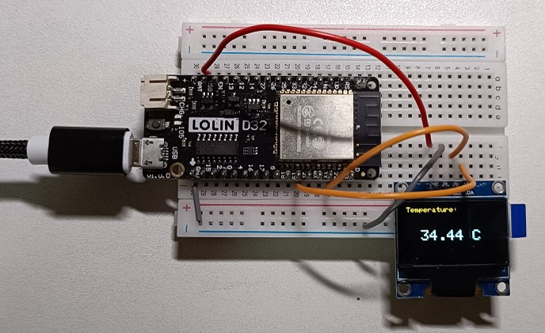

# Read_temperature_with_OLED_display

read ESP32 internal temperature sensor, and display value on OLED

# Components
* ESP32 WeMos LOLIN D32
* USB
* Breadboard
* wires
* 1 unit of OLED

# Software
* IDE: Arduino IDE with lib, "Adafruit_GFX.h" and "Adafruit_SSD1306.h"

# Wiring

| OLED | description | pin |
| ---- | ----------- | --- |
| VCC |  | |
| GND | | |
| SDA | | |
| SCL | | |
