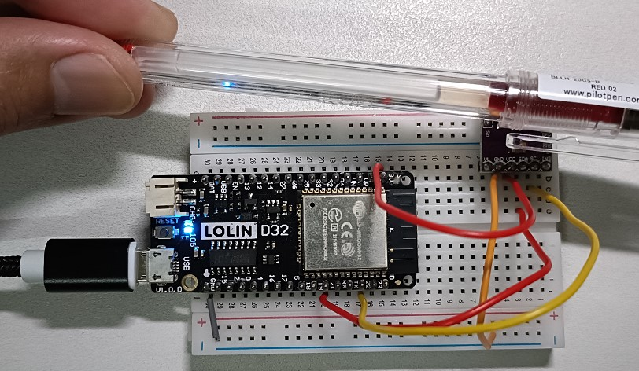

# Practice on APDS9960 Sensor

practice on APDS9960 Proximity, Light & RGB Sensor [**Datasheet**](https://cdn.sparkfun.com/assets/learn_tutorials/3/2/1/Avago-APDS-9960-datasheet.pdf)
| object | near | far |
| ------ | ---- | --- |
| |  |  |


# Components
* ESP32 WeMos LOLIN D32
* USB
* Breadboard
* wires
* 1 unit of APDS9960 Proximity, Light & RGB Sensor

# Software
* IDE: Arduino IDE with lib, "SparkFun_APDS9960.h"

# Wiring

| APDS9960 | description | ESP32 |
| ---- | ----------- | --- |
| VCC  | power | 3V |
| GND  | ground | GND |
| SDA  | I2C data | 21 |
| SCL  | I2C clock | 22 |

# Code

```C++
#include <SparkFun_APDS9960.h>
SparkFun_APDS9960 apds = SparkFun_APDS9960();

void setup() {
  // put your setup code here, to run once:
  Serial.begin(115200);
  
  while(!apds.init()){
    Serial.println("initialize error of APDS9960");
  }
  //enable APDS9960 light sensor
  while(!apds.enableLightSensor()){
    Serial.println("initialize error of light sensor");
  }
  //proximity sensor error of APDS9960
  while(!apds.enableProximitySensor()){
    Serial.println("initialize error of proximity sensor");
  }
  //define pin
  pinMode(LED_BUILTIN, OUTPUT);
  digitalWrite(LED_BUILTIN, HIGH);
}

void loop() {
  // put your main code here, to run repeatedly:
  uint8_t proximity_data = 0;
  uint16_t red_light = 0;
  uint16_t green_light = 0;
  uint16_t blue_light = 0;
  uint16_t ambient_light = 0;

  //proximity test
  if(!apds.readProximity(proximity_data)){
    Serial.println("proximity value is error");
  }
  Serial.print("proximity value: ");
  Serial.println(proximity_data);

  //as object is near, then enable color sensor
  if(proximity_data == 255){
    digitalWrite(LED_BUILTIN, LOW);

    if(!apds.readAmbientLight(ambient_light) || !apds.readRedLight(red_light) ||
        !apds.readGreenLight(green_light) || !apds.readBlueLight(blue_light)){
      Serial.println("reading value error");
    }
    else{
      Serial.print("enviroment light: ");
      Serial.print(ambient_light);
      Serial.print("  red light: ");
      Serial.print(red_light);
      Serial.print("  green light: ");
      Serial.print(green_light);
      Serial.print("  blue light: ");
      Serial.println(blue_light);
    }
  }else{
    digitalWrite(LED_BUILTIN, HIGH);
  }
  delay(1000);
}

//-------------------------------------------------------------//
//Serial Monitor display as red pen is close to sensor
/*
proximity value: 46
proximity value: 45
proximity value: 51
proximity value: 255
enviroment light: 1606  red light: 429  green light: 508  blue light: 599
proximity value: 255
enviroment light: 1579  red light: 422  green light: 500  blue light: 587
proximity value: 255
enviroment light: 1591  red light: 424  green light: 502  blue light: 591
proximity value: 255
enviroment light: 1542  red light: 403  green light: 484  blue light: 577
proximity value: 106
proximity value: 129
proximity value: 234
proximity value: 255
enviroment light: 732  red light: 208  green light: 262  blue light: 272
*/
```
