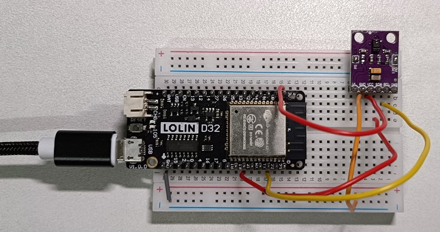

# Practice on APDS9960 Sensor

practice on APDS9960 Proximity, Light & RGB Sensor

| object | near | far |
| ------ | ---- | --- |
| |  |  |

# Components
* ESP32 WeMos LOLIN D32
* USB
* Breadboard
* wires
* 1 unit of APDS9960 Proximity, Light & RGB Sensor

# Software
* IDE: Arduino IDE with lib, "SparkFun_APDS9960.h"

# Wiring
