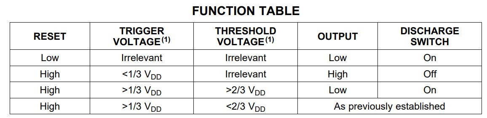

# Verify the 555 Timer Function Table

in this practice, it implement the function test on 555 timer with ESP32. here we use NE555P device for this practice, for the device specification, please refer to [**datasheet**](https://datasheet.octopart.com/NE555P-Texas-Instruments-datasheet-7284017.pdf).

# Components
* ESP32 WeMos LOLIN D32
* USB
* Breadboard
* wires
* 1 unit of NE555P
* 1 unit of RED LED
* 1 unit of 220ohm resistor

# Software
* IDE: Arduino IDE
