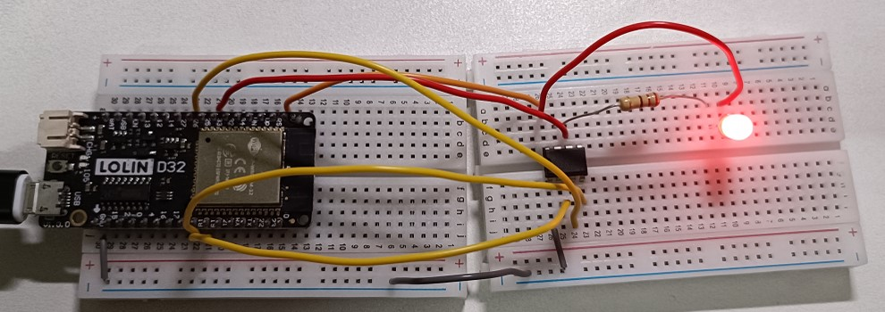

# Verify the 555 Timer Function Table

in this practice, it implement the function test on 555 timer with ESP32. here we use NE555P device for this practice, for the device specification, please refer to [**datasheet**](https://datasheet.octopart.com/NE555P-Texas-Instruments-datasheet-7284017.pdf).

# Components
* ESP32 WeMos LOLIN D32
* USB
* Breadboard
* wires
* 1 unit of NE555P
* 1 unit of RED LED
* 1 unit of 220ohm resistor

# Software
* IDE: Arduino IDE

# Wiring

To verify the output pin, we can use the digitalRead() function to read the value, but for discharge pin, it's connected to LED with 220ohm. As discharge pin is on, it pull to GND, then LED will be on. It's used for validating on/off status of discharge pin.

| NE555P | description | ESP32 |
| ---- | ----------- | --- |
| VCC | power | 3V |
| GND | ground | GND |
| Threshold | input pin | 33 |
| Trigger | input pin | 19 |
| Reset | input pin | 18 |
| Output | output pin | 26 |

