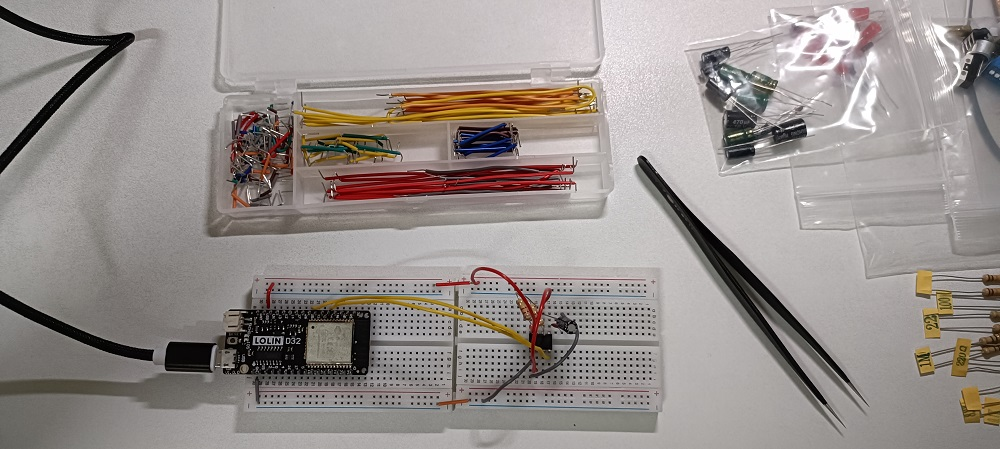

# NE555P Timer – Astable Mode Functional Test
The NE555P is a versatile precision timer IC widely used in timing, pulse generation, and oscillator applications. In astable mode, it operates as a free-running multivibrator, generating a continuous square wave without external triggering.

This test validates the NE555P’s ability to produce a stable oscillation using a specific RC network. By interfacing the timer with an ESP32 microcontroller, we measure the output frequency and verify its consistency against theoretical expectations. The goal is to ensure correct component selection, wiring integrity, and predictable timing behavior.

The test also includes force-to-fail scenarios to confirm the robustness of the validation logic—ensuring the system can detect incorrect component values, wiring faults, or disabled oscillation states.

# Components
* ESP32 WeMos LOLIN D32
* USB
* Breadboard
* wires
* 1 unit of NE555P Timer IC
* 1 unit of 8.2Kohm resistor
* 1 unit of 9.1Kohm resistor
* 1 unit of 1µF capacitor
* 1 unit of 0.01µF capacitor

Optional for Force-to-Fail Testing
* Alternate Capacitors (e.g., 0.1 µF, 10 µF)
* Alternate Resistors (e.g., 100 kΩ, 1 MΩ)

# Software
* IDE: Arduino IDE

# Wiring

| NE555P Timer | description | ESP32 |
| ---- | ----------- | --- |
| VCC (Pin 8) | 5.0V | VUSB |
| GND (Pin 1) | GND | GND |
| OUT (Pin 3) | frequency measurement | GPIO34 |
| RESET (Pin 4) | enabling/disabling the timer | GPIO26 |

Passive Components for ~54.5 Hz Oscillation
- **RA (Resistor):** 8.2kΩ, connected between VCC and DISCHARGE (Pin 7).
- **RB (Resistor):** 9.1kΩ, connected between DISCHARGE (Pin 7) and THRESHOLD (Pin 6).
- **C1 (Capacitor):** 1µF, connected between THRESHOLD (Pin 6) and GND.
- **C2 (Capacitor):** 0.01µF, connected between CONTROL (Pin 5) and GND for stability.

Notes
- THRESHOLD (Pin 6) and TRIGGER (Pin 2) must be connected together.
- The circuit is designed to generate a continuous square wave when RESET is held HIGH.


# Code
This program validates the behavior of a NE555P timer configured in astable mode, where it operates as a free-running oscillator. Using an ESP32 microcontroller, the test measures the output frequency generated by the NE555 and compares it against a target value (~54.5 Hz) with a defined tolerance.

The test setup includes:
* A resistor-capacitor network (RA, RB, C1) that determines the oscillation frequency.
* ESP32 GPIO34 to measure the output waveform.
* ESP32 GPIO26 to control the RESET pin, enabling or disabling the timer.

The program uses pulseIn() to capture high and low durations of the output signal, calculates the frequency, and reports whether the result falls within the acceptable range. It also detects failure conditions such as missing oscillation or incorrect timing, making it suitable for both functional validation and fault injection testing.
```C++
/**
 * @file NE555P_Astable_Test.cpp
 * @brief Functional Test for NE555P Timer in Astable (Oscillator) Mode.
 * @details This program verifies that the NE555P, configured with specific
 * resistors and a capacitor, oscillates at the correct frequency.
 *
 * Test Platform: ESP32
 * Target Device: NE555P Timer
 *
 * Connections (from circuit_interface-NE555P_interface.md):
 * - ESP32 5V     -> NE555P Pin 8 (VCC)
 * - ESP32 GND    -> NE555P Pin 1 (GND)
 * - ESP32 GPIO26 -> NE555P Pin 4 (RESET)
 * - ESP32 GPIO34 -> NE555P Pin 3 (OUT)
 *
 * Astable components: RA=8.2k, RB=9.1k, C1=1uF
 */

// Pin definitions from pin_define-NE555P.json
const int RESET_PIN = 26;
const int OUT_PIN = 34;

// Test parameters from test_flow-NE555P_test.yaml
const float TARGET_FREQUENCY_HZ = 54.5;
const float TOLERANCE_PERCENT = 15.0;
const unsigned long TEST_INTERVAL_MS = 5000;

// Calculated frequency range for PASS condition
const float MIN_FREQ = TARGET_FREQUENCY_HZ * (1.0 - (TOLERANCE_PERCENT / 100.0));
const float MAX_FREQ = TARGET_FREQUENCY_HZ * (1.0 + (TOLERANCE_PERCENT / 100.0));

void setup() {
  // Start serial communication for outputting test results
  Serial.begin(115200);
  delay(1000); // Wait for serial monitor to connect

  Serial.println("--- NE555P Astable Mode Frequency Test (Revised Components) ---");
  Serial.printf("Target Frequency: %.2f Hz\n", TARGET_FREQUENCY_HZ);
  Serial.printf("Acceptable Range: %.2f Hz to %.2f Hz\n", MIN_FREQ, MAX_FREQ);

  // Configure pin modes
  pinMode(RESET_PIN, OUTPUT);
  pinMode(OUT_PIN, INPUT);

  // Enable the NE555P timer by pulling the RESET pin HIGH
  Serial.println("Enabling 555 timer (RESET pin HIGH)...");
  digitalWrite(RESET_PIN, HIGH);
}

void loop() {
  Serial.println("\n------------------------------------");
  Serial.println("Starting new measurement cycle...");

  // Measure the high and low pulse durations from the OUT pin
  // pulseIn has a default timeout of 1 second, which is sufficient here.
  long high_duration_us = pulseIn(OUT_PIN, HIGH, 2000000); // Increased timeout for lower frequency
  long low_duration_us = pulseIn(OUT_PIN, LOW, 2000000);  // Increased timeout for lower frequency

  // Check if pulseIn timed out (returned 0)
  if (high_duration_us == 0 || low_duration_us == 0) {
    Serial.println("Measurement FAIL: pulseIn() timed out. Check wiring or component values.");
    Serial.println("Is the OUT pin oscillating?");
  } else {
    // Calculate total period and frequency
    long period_us = high_duration_us + low_duration_us;
    float frequency_hz = 1000000.0 / period_us;

    Serial.printf("  -> High Duration: %ld us\n", high_duration_us);
    Serial.printf("  -> Low Duration:  %ld us\n", low_duration_us);
    Serial.printf("  -> Total Period:  %ld us\n", period_us);
    Serial.printf("  -> Measured Frequency: %.2f Hz\n", frequency_hz);

    // Verify the result against the expected range
    if (frequency_hz >= MIN_FREQ && frequency_hz <= MAX_FREQ) {
      Serial.println("Result: PASS - Frequency is within the expected range.");
    } else {
      Serial.println("Result: FAIL - Frequency is outside the expected range.");
    }
  }

  // Wait for the specified interval before repeating the test
  Serial.println("------------------------------------");
  delay(TEST_INTERVAL_MS);
}
```
