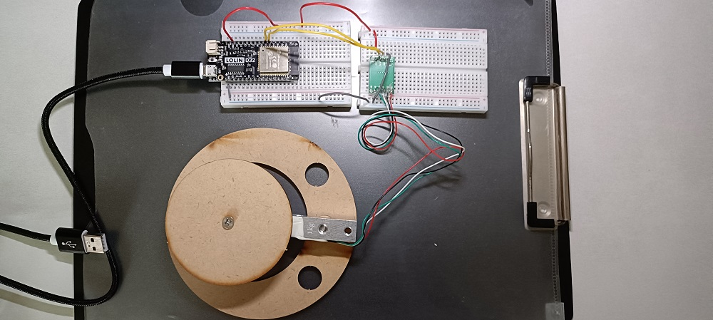

# HX711 module Load Cell Calibration (Weight Sensor Validation)

This step validates the **weight sensing functionality** using the HX711 Load Cell Amplifier module by establishing a correct calibration factor and zeroing the scale. This ensures the HX711 can accurately measure object weight for subsequent classification rules.

The final calibration factor of **50.4** was determined through trial-and-error to achieve high accuracy ($\approx 9.1 \text{ g}$ for a $9.2 \text{ g}$ standard weight).

-----

# Components

  - **ESP32** Control Board
  - **HX711** Load Cell Amplifier Module as below image
  - **Load Cell** (Strain Gauge)
  - Jumper wires
  - Permanent Weighing Platform (wood or plastic)
  - Standard Weight: **50 NTD Coin** (Known Weight $\approx 9.2 \text{ g}$)



-----

# Software

  - **IDE**: Arduino IDE (or PlatformIO)
  - **Required Library**: **HX711\_ADC** (by Bogdan Necula)
    (Ensure this library version is compatible with your `getData()` and `tare()` calls).

-----

# Wiring

| HX711 Pin | Description | Load Cell Wire | ESP32 Pin |
| :---: | :---: | :---: | :---: |
| VCC | Power (5V Recommended) | — | **5V (VBUS)** |
| GND | Ground | — | **GND** |
| E+ | Excitation Voltage (+) | **Red** | — |
| E- | Excitation Voltage (-) | **Black** | — |
| A+ | Analog Signal (+) | **Green** or **White** | — |
| A- | Analog Signal (-) | **White** or **Green** | — |
| **DOUT** | Digital Data | — | **GPIO33** |
| **CLK** | Digital Clock | — | **GPIO32** |

⚠️ **CRITICAL NOTE**: The stability of the **E+** and **E-** (Excitation) connections is paramount. Loose connections here result in a complete loss of signal (Raw Value $\approx 0$), leading to inaccurate readings.

-----

# Calibration Code

The following code incorporates the final, validated **Calibration Factor** and performs the necessary **Tare** (zeroing) operation to stabilize the scale reading with the permanent platform in place.

```cpp
// -----------------------------------------------------------------
// HX711 Load Cell Calibration Code (Final Stable Version)
// -----------------------------------------------------------------

#include "HX711_ADC.h"

// Pin Definitions
const int HX711_DAT_PIN = 33; 
const int HX711_CLK_PIN = 32; 

HX711_ADC LoadCell(HX711_DAT_PIN, HX711_CLK_PIN);

// FINAL Calibration Factor determined by trial-and-error
const float CALIBRATION_FACTOR = 50.4; 
const float COIN_WEIGHT_G = 9.2; 

void setup() {
  Serial.begin(115200);
  Serial.println("--- HX711 Calibration Setup ---");

  // Initialization
  LoadCell.begin();
  LoadCell.start(200); 

  if (LoadCell.getTareStatus() == 0) { 
    Serial.println("HX711 Started.");
  } else {
    Serial.println("HX711 Failed! Check Hardware.");
  }

  // --- TARE (ZEROING) PROCESS ---
  Serial.println("Performing Tare (Zeroing) with wood platform...");
  LoadCell.setSamplesInUse(1); 
  LoadCell.powerUp();     
  LoadCell.tare(); // Sets the platform's weight as the new zero point
  LoadCell.setCalFactor(CALIBRATION_FACTOR);
  delay(500); 

  Serial.println("Zeroing Complete! Factor locked to 50.4.");
  Serial.println("-------------------------------------");
  Serial.print(">> FINAL VERIFICATION: Place 50 NTD coin (");
  Serial.print(COIN_WEIGHT_G, 1);
  Serial.println(" g) for verification.");
  Serial.println("-------------------------------------");
}

void loop() {
  static boolean newDataReady = 0;
  if (LoadCell.update()) {
    newDataReady = true;
  }
  
  if (newDataReady) {
    float weightRaw = LoadCell.getData(); 
    float currentWeight = weightRaw / CALIBRATION_FACTOR;

    Serial.print("Raw Value (Long): ");
    Serial.print((long)weightRaw);
    Serial.print(" | Converted Weight (g): ");
    Serial.println(currentWeight, 2); 

    newDataReady = false;
  }
  
  delay(100); 
}
```