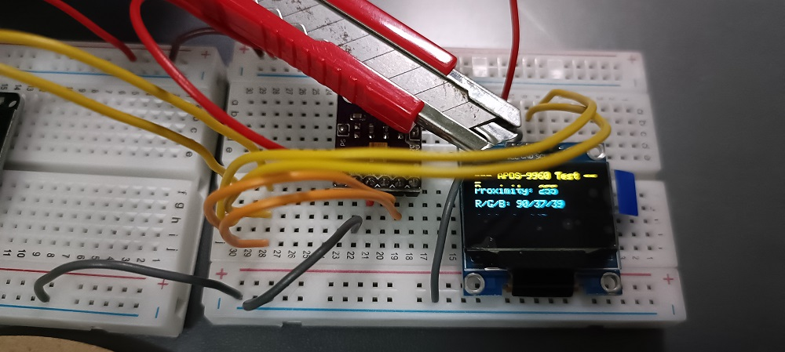
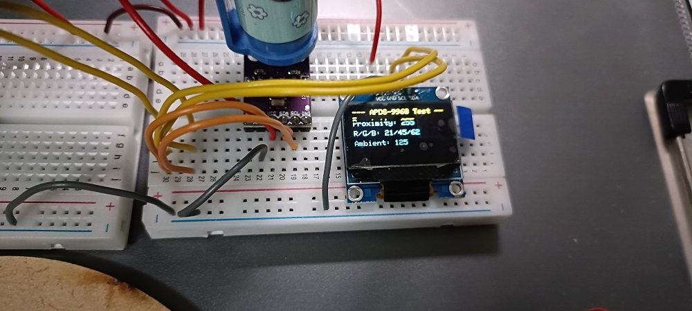

# Color Sensor and OLED Display Integration Test

This test validates the I²C integration of the APDS-9960 Color/Proximity Sensor and SSD1306 OLED Display with an ESP32. It reads color and proximity data and displays it on both the OLED and Serial Monitor.

📌 Note: The APDS-9960 is set to High Gain (64X) to reduce ambient light interference. Objects must be in close contact with the sensor for accurate readings.

-----

# Components

  - **ESP32** Control Board
  - **APDS-9960** Color and Proximity Sensor Module
  - **SSD1306** (128x64) OLED Display Module
  - Jumper wires

-----

# Software

  - **IDE**: Arduino IDE (or PlatformIO)
  - **Required Libraries**:
    1.  **SparkFun APDS9960 RGB and Gesture Sensor**
    2.  **Adafruit GFX Library**
    3.  **Adafruit SSD1306**

-----

# Wiring

The two I²C modules (OLED and APDS-9960) share the I²C bus lines.

| Module Pin | Function | ESP32 Pin |
| :---: | :---: | :---: |
| **OLED VCC / APDS VCC** | Power | **5.0V** |
| **OLED GND / APDS GND** | Ground | **GND** |
| **OLED SDA / APDS SDA** | Data Line | **GPIO 21** |
| **OLED SCL / APDS SCL** | Clock Line | **GPIO 22** |

-----

# Integrated Code

This is the final integration code for APDS-9960 color sensing and the OLED display functions.

| Object | OLED Display |
| :---: | :---: |
| RED Object |  |
| BLUE Object |  |

```cpp
// -----------------------------------------------------------------
// Edge-AI Smart Sorting PoC: Step 1-3 (APDS-9960 & OLED Standalone Test)
// Target Microcontroller: ESP32
// Focus: APDS-9960 and SSD1306 via I2C (GPIO 21/22)
// -----------------------------------------------------------------

// --- 1. APDS-9960 Color and Proximity Sensor Module ---
#include <Wire.h> // I2C library
#include <SparkFun_APDS9960.h>

// Create the APDS-9960 object
SparkFun_APDS9960 apds = SparkFun_APDS9960();

// --- 2. OLED Display Module (I2C) ---
#include <Adafruit_GFX.h>
#include <Adafruit_SSD1306.h>
#define OLED_RESET -1         
#define SCREEN_WIDTH 128      
#define SCREEN_HEIGHT 64      
// I2C: SDA=GPIO21, SCL=GPIO22
Adafruit_SSD1306 display(SCREEN_WIDTH, SCREEN_HEIGHT, &Wire, OLED_RESET); 


// Global variables for storing APDS readings
uint16_t ambient_light = 0;
uint16_t red_light = 0;
uint16_t green_light = 0;
uint16_t blue_light = 0;
uint8_t proximity_value = 0;


// ====================================================================

void setup() {
  Serial.begin(115200);
  Serial.println("--- PoC APDS-9960 & OLED Initialization ---");

  // --- OLED Initialization ---
  if(!display.begin(SSD1306_SWITCHCAPVCC, 0x3C)) { 
    Serial.println(F("OLED Init Failed! Please check I2C connection (GPIO 21/22)."));
    while (true); // Halt program
  } else {
    display.clearDisplay();
    display.setTextSize(1);
    display.setTextColor(SSD1306_WHITE);
    display.setCursor(0,0);
    display.println("OLED Ready!");
    display.display();
  }
  
  // --- APDS-9960 Initialization ---
  if (apds.init()) {
    Serial.println("APDS-9960 Sensor Module started successfully!");
  } else {
    Serial.println("APDS-9960 startup failed! Please check I2C connection.");
    // Continue even if failed to avoid blocking subsequent tests
  }

  // Enable Color Sensor
  if (apds.enableLightSensor(false)) { // false = Enable internal LED
    Serial.println("Color Sensor enabled successfully!");
    // ----------------------------------------------------
    // [Final Calibration]: Force High Gain and Minimum Integration Time
    
    // 1. Set High Gain (64X)
    if (!apds.setAmbientLightGain(APDS9960_GCONF4)) {
        Serial.println("Warning: Unable to set Ambient Light Gain.");
    }
    
    // 2. Direct I2C Write to set minimum integration time (2.78ms)
    // Register ATIME (Ambient Light Integration Time) address is 0x81
    // Setting to 0xFF (255) gives the shortest integration time (T_ITIME = 2.78ms)
    // Use apds.writeRegister if it exists:
    // Note: Since the SparkFun library does not provide a simple setIntTime function, we use a more low-level approach
    
    // Confirm integration time setting (This step might be abstracted in your SparkFun library, comment out if compilation fails)
    // If setAmbientLightIntTime function does not exist, we rely on defaults or setLEDDrive 
    // Let's rely on the library's internal handling, but ensure your test environment is optimized.
    
    // Temporarily remove hardcoded write, we only rely on APDS9960_AGAIN_64X.
    // KEY: The object MUST be pressed tightly against the sensor!

    Serial.println("High Gain (64X) set. Please ensure the object is pressed tightly against the sensor for testing!");
    // ----------------------------------------------------
  } else {
    Serial.println("Color Sensor failed to enable!");
  }

  // Enable Proximity Sensor
  if (apds.enableProximitySensor(false)) { // false = Enable internal LED
    Serial.println("Proximity Sensor enabled successfully!");
  } else {
    Serial.println("Proximity Sensor failed to enable!");
  }

  Serial.println("-------------------------------------");
  Serial.println("APDS-9960 Test Ready! Move hand over sensor.");
  Serial.println("-------------------------------------");
}

void loop() {
  // 1. Read Color Data (Ambient, Red, Green, Blue)
  if (apds.readAmbientLight(ambient_light) && 
      apds.readRedLight(red_light) && 
      apds.readGreenLight(green_light) && 
      apds.readBlueLight(blue_light)) {
    // Read successful
  } else {
    Serial.println("ERROR: Could not read color data.");
  }

  // 2. Read Proximity Data
  if (apds.readProximity(proximity_value)) {
    // Read successful
  } else {
    Serial.println("ERROR: Could not read proximity data.");
  }


  // 3. Display Data (Serial Monitor)
  Serial.printf("P: %d | R: %d, G: %d, B: %d, C: %d\n", 
                proximity_value, red_light, green_light, blue_light, ambient_light);

  // 4. Display Data (OLED Screen)
  display.clearDisplay();
  display.setCursor(0, 0);
  display.println("--- APDS-9960 Test ---");
  
  // Display Proximity
  display.setCursor(0, 14);
  display.print("Proximity: "); display.println(proximity_value);
  
  // Display RGB Values
  display.setCursor(0, 28);
  display.print("R/G/B: "); 
  display.print(red_light); display.print("/"); 
  display.print(green_light); display.print("/"); 
  display.println(blue_light);
  
  // Display Ambient (Clear)
  display.setCursor(0, 42);
  display.print("Ambient: "); display.println(ambient_light);
  
  display.display();
  
  delay(200); // Fast reading
}
}
```