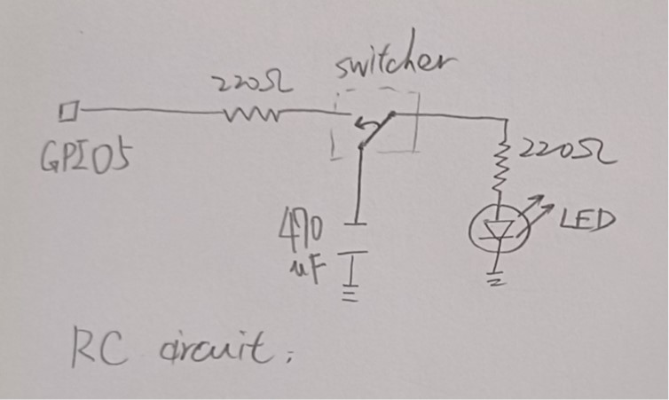
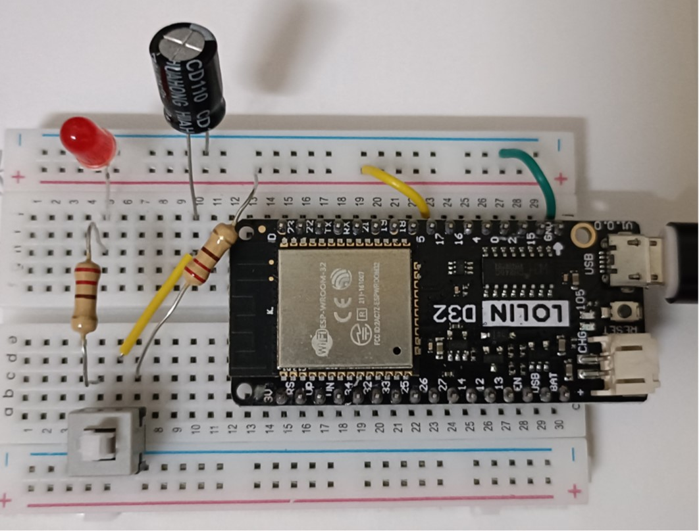

# RC circuit

Implement a RC circuit with LED light to check if it works
# 

# Components
* ESP32 WeMos LOLIN D32
* USB
* 1 unit of LED
* 2 unit of 220Ω
* Breadboard
* wires
* 1 unit of 470uF capacitor
* 1 unit of electronic switcher

# Software
* IDE: Arduino IDE

# Wiring


# Code
* use GPIO5 as a power source
* push switcher to see if RC circuit lights up LED, and LED light will fade as capacitor dischaging

```C++
int GPIO_pin = 5;

void setup() {
  // put your setup code here, to run once:
  Serial.begin(115200);
  pinMode(GPIO_pin, OUTPUT);
}

void loop() {
  // put your main code here, to run repeatedly:
  digitalWrite(GPIO_pin,LOW);
}

```
