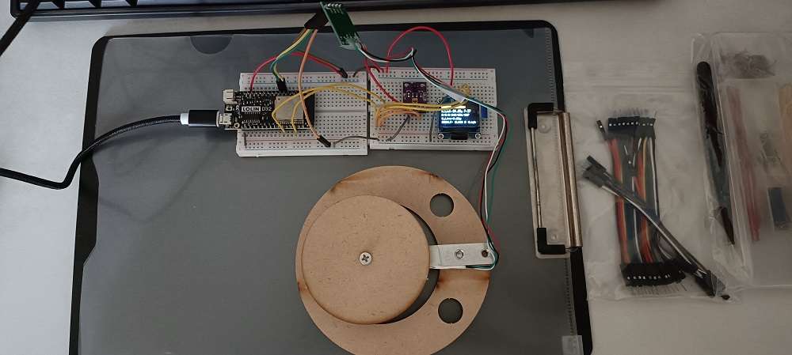
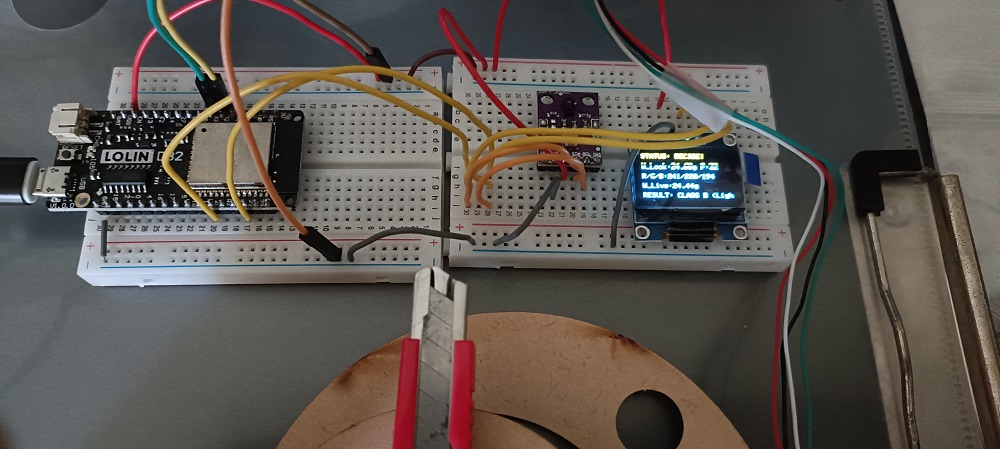

# Sensor Fusion with HX711 & APDS-9960 Modules

This module implements **sensor fusion** and **edge decision-making** on the ESP32 by integrating data from:

- 🏋️ **HX711 Load Cell** (for weight)
- 🎨 **APDS-9960 Color Sensor** (for RGB + proximity)

The system performs real-time classification of objects into three categories using a robust decision tree. Special attention is given to overcoming APDS-9960’s limitations with dark or blue objects by applying **ratio-based color discrimination**.

---

# Sensor Fusion Inputs & Stabilization

All sensor readings are processed through a dedicated state machine (`STATE_COLOR_READING`) to ensure stability and reduce noise. Each input undergoes averaging and burn-in to produce reliable decision variables.

| Input Type | Sensor Module | Stabilization Method | Final Variable |
|------------|----------------|-----------------------|----------------|
| **Weight** | HX711 Load Cell | 15-sample moving average (`WEIGHT_STABILITY_COUNT`) | `finalWeight` *(float)* |
| **Color (R/G/B)** | APDS-9960 | 5-sample burn-in + 25-sample average | `red_light`, `green_light`, `blue_light` *(uint16_t)* |

---

# Decision Constants & Thresholds

These constants govern the classification logic and can be tuned for calibration or environmental adjustments.

| Constant | Value | Purpose |
|----------|-------|---------|
| `CLASSIFY_WEIGHT_THRESHOLD` | 50.0 g | Distinguishes **Heavy (Class A)** from **Light** objects |
| `RED_RATIO_THRESHOLD` | 1.2 | Classifies **Red objects** when R > 1.2 × G and R > B |
| `PROXIMITY_COLOR_THRESHOLD` | 50 | Confirms object presence before color reading (`STATE_WAIT_FOR_MOVE`) |
| **Auto-Reset Condition** | P < 30 AND W < 5.0 g | Returns system to `IDLE` when no object is present |

---

## 🧭 Edge Decision Tree Logic

The decision engine operates in `STATE_DECISION_READY` using a strict **IF–THEN–ELSE** priority structure. Once a condition is met, classification is finalized and no further checks are made.

| Priority | Condition | Classification | Servo Target Zone |
|----------|-----------|----------------|--------------------|
| **1** | `finalWeight >= 50.0` | **CLASS A (Heavy)** | Heavy Items Zone |
| **2** | `finalWeight < 50.0` AND `red_light > green_light × 1.2` AND `red_light > blue_light` | **CLASS B (Light Red)** | Light Red Items Zone |
| **3** | *Else* | **CLASS C (Light Other)** | Residual Zone (includes dark/blue items) |

Setup


Red Object

```txt
OUTPUT for different objects

--- CLASSIFICATION DATA READY ---
FINAL DATA: Weight=24.36g, R=48, G=21, B=23
-> CLASSIFICATION RESULT: CLASS B (Light Red)
--- Waiting for object removal for next cycle ---

--- Cycle Complete. System Resetting. ---

-> State Change: WEIGHT_READING (Object detected, starting stabilization).
-> Weight Locked (Avg. of 15): 19.68g. Please move object to the Color Station.
-> State Change: COLOR_READING (Object detected, starting stabilization with burn-in).
....   [Color] Burn-in complete (5 readings discarded). Starting averaging...

-> Color Locked (Avg. of 25): R:92, G:132, B:115. Data Collection Complete.

--- CLASSIFICATION DATA READY ---
FINAL DATA: Weight=19.68g, R=92, G=132, B=115
-> CLASSIFICATION RESULT: CLASS C (Light Other)
--- Waiting for object removal for next cycle ---

--- Cycle Complete. System Resetting. ---

-> State Change: WEIGHT_READING (Object detected, starting stabilization).
-> Weight Locked (Avg. of 15): 666.39g. Please move object to the Color Station.
-> State Change: COLOR_READING (Object detected, starting stabilization with burn-in).
....   [Color] Burn-in complete (5 readings discarded). Starting averaging...

-> Color Locked (Avg. of 25): R:76, G:59, B:42. Data Collection Complete.

--- CLASSIFICATION DATA READY ---
FINAL DATA: Weight=666.39g, R=76, G=59, B=42
-> CLASSIFICATION RESULT: CLASS A (Heavy)
--- Waiting for object removal for next cycle ---
```