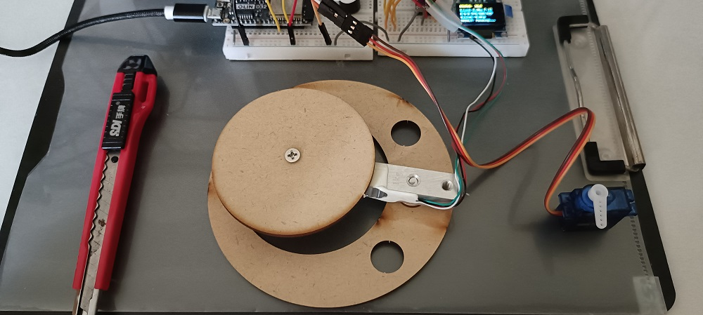

# Edge-AI Smart Sorting System

This project developed a Proof-of-Concept for an **Edge-AI** object sorting system. The system's objective is to use multiple sensors to **collect data in real-time** (weight and color), perform **immediate classification** on the microcontroller (ESP32), and drive a servo motor to sort objects into three predefined categories.

Code is [_here_](./Smart_Sorting_System_with_HX711_and_APDS-9960.py)
# Hardware and Core Components

| Module Category     | Component                  | Model/Description         | Function                                                                 |
| :-----------------: | :------------------------: | :-----------------------: | :----------------------------------------------------------------------: |
| **Main Controller** | Microcontroller            | ESP32                     | Runs the state machine, processes sensor data, and manages actuation.   |
| **Weight Sensing**  | Load Cell + HX711          | HX711 Amplifier           | Measures the precise weight of objects. (Calibration Factor **50.4**)   |
| **Color Sensing**   | Color Sensor               | APDS-9960                 | Measures Red (R), Green (G), and Blue (B) light intensity.              |
| **Actuator**        | Servo Motor                | SG90                      | Executes the sorting action, angle range **0° ~ 180°**.                 |
| **User Interface**  | Display Unit               | OLED (128x64)             | Displays real-time status, weight, and classification results.          |
| **Feedback System** | Buzzer                     | —                         | Provides audio confirmation upon classification completion.             |

# Core Sorting Logic (Classification Rules)

The system uses a two-tier decision structure. Thresholds were finely tuned to match the hardware environment:

| Class                        | SG90 Angle  | Decision Rule (Condition)                                               |
| :--------------------------: | :---------: | :----------------------------------------------------------------------: |
| **CLASS A (Heavy)**          | **180°**    | Weight ≥ **50.0 g**                                                     |
| **CLASS B (Light Red)**      | **90°**     | Weight < **50.0 g** **AND** (Red > Green × **1.2**)                     |
| **CLASS C (Light Other)**    | **0°**      | Does not meet A or B conditions (Light & Not Red)                       |
| **Reset**                    | **0°**      | Automatically returns to home position after object removal             |

# Key Technical Challenges and Solutions

The biggest challenge during development was achieving reliable and precise control of the **servo motor** on the ESP32 core:

| Challenge             | Root Cause                                                                 | Solution (Final Code Fix)                                                                 |
| :-------------------:| :-------------------------------------------------------------------------:| :----------------------------------------------------------------------------------------: |
| **Library Conflicts**| Arduino IDE linking the wrong AVR Servo library for ESP32.                 | **Manual deletion** of the conflicting library directory.                                 |
| **PWM Control Failure**| ESP32's OS interrupts disrupted the microsecond-level timing for SG90 PWM. | Implemented **Interrupt-Protected Manual Pulse Generation** using `noInterrupts()` and `delayMicroseconds()` for stable **500~2500μs** pulses. |
| **Unstable Homing**  | Servo failed to reliably return to 0° after sorting action.                | **Reinforced Homing Logic:** Sent **50 continuous 0° pulses** followed by a **500 ms** delay to ensure motor stabilizes at home position. |

# Project Outcome

After successful debugging and validation, all technical requirements for the system were met:

- **Sensing Stability** is confirmed for both weight and color data acquisition.
- **Actuation Reliability** is achieved, with the SG90 servo motor successfully rotating to **0°**, **90°**, and **180°** based on classification results, and reliably homing.
- **System Integration** is complete, demonstrating a working **Sense → Decide → Actuate** cycle for automated sorting.

This project successfully proves the feasibility of running complex, real-time classification tasks on a resource-constrained **ESP32** at the edge.
| State  | Result |
| :----: | :----: |
| IDLE |  |
| RED OBJECT |  |
| HEAVY OBJECT |  |