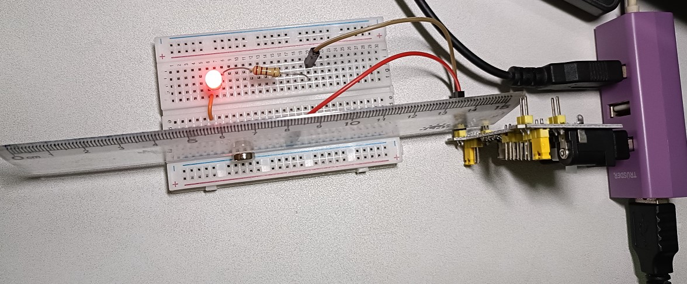
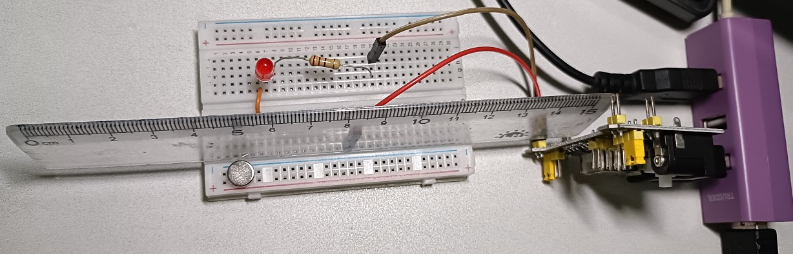

# 🎯 Project Title: **Simple Magnetic Control Light using a Reed Switch**

## 🤔 Problem Statement

Is it possible to use a **reed switch** and **LED** to create a simple, contactless lighting device that can be remotely (at close range) controlled by a magnet without a physical switch?

---

## 📝 Hypothesis & Objectives

**Hypothesis:** When a magnet approaches the reed switch, the circuit closes and powers the LED; when the magnet is removed, the circuit opens and the LED turns off.  
**Objectives:**

1. Successfully build a **basic circuit** controlled by a reed switch.  
2. Verify that a **small magnet** can reliably control the LED light.  
3. Use household cardboard or containers to create a **simplified lamp housing**.

---

## 🛠 Required Materials and Tools

| Material/Tool | Quantity (from resource list or household) |
| :--- | :--- |
| **Small Magnet** (Resource: Electronics) | ×1 |
| **Reed Switch (Domestic Silver Pins)** (Resource: Electronics) | ×1 |
| **LED** (Resource: Electronics) | ×1–2 |
| **Resistor (220Ω or 100Ω)** (Resource: Electronics) | ×1 (for LED protection) |
| **7-12V to 3.5V/5.0V DC converter** (Resource: Electronics) | ×1 (power supply) |
| **Breadboard** (Resource: Core Module/Electronics) | ×1 (for wiring) |
| **Breadboard Jump Wires** or **DuPont Wires** (Resource: Core Module/Electronics) | As needed |

---

## 📜 Step-by-Step Procedures

| Step | Description |
| :--- | :--- |
| **step_01** | **Prepare and Fix Components**: Insert the **reed switch** and **LED** into the **breadboard**. Ensure the reed switch's two legs are connected to the circuit. Connect the LED's long leg (positive) to power, and the short leg (negative) to the resistor. |
| **step_02** | **Connect the Protective Resistor**: Attach a **resistor** (e.g., **220Ω**) to the LED's negative leg to limit current and protect the LED. |
| **step_03** | **Build the Basic Circuit**: Connect the **positive terminal of the DC converter** to one end of the **reed switch**. Connect the other end of the reed switch to the **positive leg of the LED** (long leg). |
| **step_04** | **Complete the Negative Connection**: Connect the **negative terminal of the DC converter** to the other end of the **resistor**. The circuit is now in series: **Battery → Reed Switch → LED → Resistor → DC converter**. |
| **step_05** | **Conduct Magnetic Control Test**: power on DC converter. Bring the **small magnet** close to the reed switch and observe if the **LED** lights up. Test if the LED turns off when the magnet is removed. |
| **step_06** | **Design and Assemble Housing**: Fix the breadboard circuit inside a **small bowl or container**, serving as a simplified **lamp housing and shade**. Mark the reed switch's sensing position on the outside. |
| **step_07** | **Function Verification**: Use the magnet through the housing (bowl or container) to operate the switch and verify the **contactless control** functionality of the magnetic light.

---

## ✅ Expected Outcomes and Applications

| Category | Description |
| :--- | :--- |
| **Expected Outcomes** | 1. **Successfully build** a simple power on/off switch using a reed switch. 2. Confirm that magnetic sensing is a viable **contactless switch** control method. 3. Create a **small lighting device** controlled by a magnet. |
| **Application Scenarios** | 1. **Hidden Switches**: Ideal for furniture, cabinets, or doors where lighting turns on when opened and off when closed. 2. **Educational Model**: A simple and engaging demonstration model for **electromagnetic principles**. 3. **Creative Installations**: Integrate into toys or artworks for **wireless interactive control** using magnets embedded in other objects. |

---

## Outcomes

| Status | Result |
| :--- | :--- |
| **ON** |  |
| **OFF** |  |