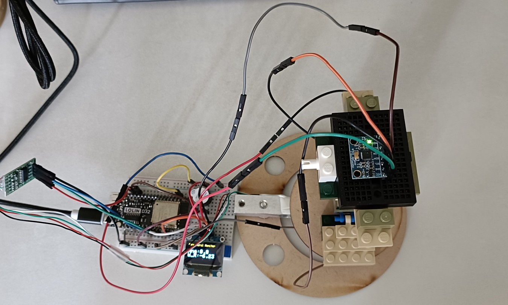
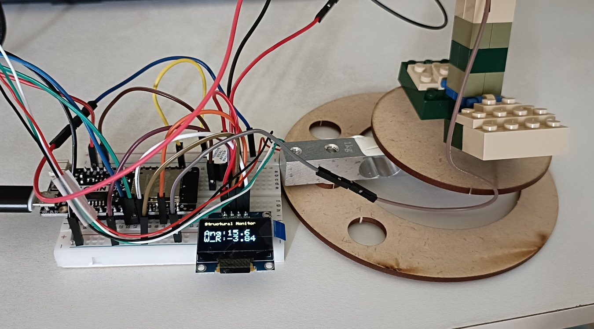

## 🧪 Angle-Pressure Chain Reaction for Monitoring Tilting Structure

### 📝 Problem Statement

In tall structures (such as tower cranes or bridge piers), a slight tilt caused by foundation displacement triggers a horizontal shift in the **Center of Gravity**. This displacement generates an additional **"overturning moment,"** which forces a redistribution of pressure at the structure's base. This project aims to quantify how the height of the CoG amplifies this pressure imbalance and to establish a predictive early-warning model.

### 🎯 Hypothesis & Objectives

* **Hypothesis**: The higher the structure's center of gravity, the faster the rate of pressure increase at the pivot point () for any given angle of tilt.
* **Structural Stability Simulation**: [_Code_](Angle-Pressure_Chain_Reaction_for_Monitoring_Tilting_Structure.py)
* **Objectives**:
1. Use an **ESP32** to simultaneously capture real-time angle and pressure data.
2. Calculate the **"Instability Coefficient"** (rate of pressure change) dynamically.
3. Visualize data on an **OLED display** and trigger a **buzzer alarm** at critical thresholds.

---

## 🔌 Complete Wiring Table

> **Note:** The 3.3V rail on the ESP32 has limited current output. If the system becomes unstable while driving multiple modules, consider connecting the HX711 VCC to the **5V (Vin)** pin.

| Component | Pin | ESP32 Pin (GPIO) | Remarks |
| --- | --- | --- | --- |
| **OLED Display** | **VCC** | **3.3V** | **Power Supply** |
|  | **GND** | **GND** | **Ground** |
|  | SCL | GPIO 22 | I2C Clock |
|  | SDA | GPIO 21 | I2C Data |
| **MPU6050** | **VCC** | **3.3V** | Accelerometer/Gyro |
|  | **GND** | **GND** |  |
|  | SCL | GPIO 22 | Shared I2C Bus |
|  | SDA | GPIO 21 | Shared I2C Bus |
| **HX711 Module** | VCC | 3.3V or 5V | Load Cell Amplifier |
|  | GND | GND |  |
|  | DT (Data) | GPIO 18 |  |
|  | SCK (CLK) | GPIO 19 |  |
| **Active Buzzer** | Positive (+) | GPIO 13 | Alarm Output |
|  | Negative (-) | GND |  |

---

## ⚙️ Step-by-Step Implementation Guide

1. **Structural Assembly**:
* Use LEGO or similar materials to build a long baseplate (acting as a **lever**). Fix one end as a stationary pivot and rest the other end on the **load cell**.
* Build a vertical tower (15–20 cm) on the baseplate. Mount a **heavy motor** or weight at the top to serve as the high CoG.

| Stable | Tilt |
| ---- | ---- |
|  |  |

2. **Sensor Mounting**: Secure the MPU6050 firmly to the top of the tower to detect tilt angles accurately.
3. **Calibration**:
* Place the structure on a level surface and run the `scale.tare()` function to zero the scale.
* Record the baseline weight while the structure is perfectly horizontal.

4. **Data Collection**:
* Slowly elevate the fixed pivot end to simulate a foundation tilt.
* Observe the OLED to monitor how the weight/pressure curve correlates with the increasing angle.


---

## 💻 ESP32 Integrated Code

Please ensure you have installed the `Adafruit SSD1306`, `Adafruit MPU6050`, and `HX711` libraries in your Arduino IDE.

```cpp
#include <Wire.h>
#include <Adafruit_GFX.h>
#include <Adafruit_SSD1306.h>
#include <Adafruit_MPU6050.h>
#include <Adafruit_Sensor.h>
#include "HX711.h"

// OLED Settings
#define SCREEN_WIDTH 128
#define SCREEN_HEIGHT 64
Adafruit_SSD1306 display(SCREEN_WIDTH, SCREEN_HEIGHT, &Wire, -1);

// Sensors & Pins
Adafruit_MPU6050 mpu;
const int DT_PIN = 18, SCK_PIN = 19, BUZZER = 13;
HX711 scale;

float baseWeight = 0;

void setup() {
  Serial.begin(115200);
  pinMode(BUZZER, OUTPUT);

  // Initialize OLED
  if(!display.begin(SSD1306_SWITCHCAPVCC, 0x3C)) { 
    Serial.println("OLED failed");
    for(;;);
  }
  display.clearDisplay();
  display.setTextColor(WHITE);

  // Initialize MPU6050
  if (!mpu.begin()) { Serial.println("MPU6050 failed"); }

  // Initialize HX711
  scale.begin(DT_PIN, SCK_PIN);
  scale.set_scale(); // Insert your calibration factor here
  scale.tare(); 
  baseWeight = scale.get_units(10);
}

void loop() {
  sensors_event_t a, g, temp;
  mpu.getEvent(&a, &g, &temp);

  // Calculate tilt angle and weight ratio
  float angleX = atan2(a.acceleration.y, a.acceleration.z) * 180 / PI;
  float currentWeight = scale.get_units(5);
  float ratio = currentWeight / baseWeight;

  // OLED Display Logic
  display.clearDisplay();
  display.setCursor(0,0);
  display.setTextSize(1);
  display.println("Structural Monitor");
  display.setCursor(0,20);
  display.setTextSize(2);
  display.print("Ang:"); display.println(abs(angleX), 1);
  display.print("W_R:"); display.println(ratio, 2);
  display.display();

  // Alarm Logic: Tilt > 15 degrees OR weight shift > 50%
  if (abs(angleX) > 15.0 || ratio > 1.5) {
    digitalWrite(BUZZER, HIGH);
    delay(100);
    digitalWrite(BUZZER, LOW);
  }

  delay(200);
}

```