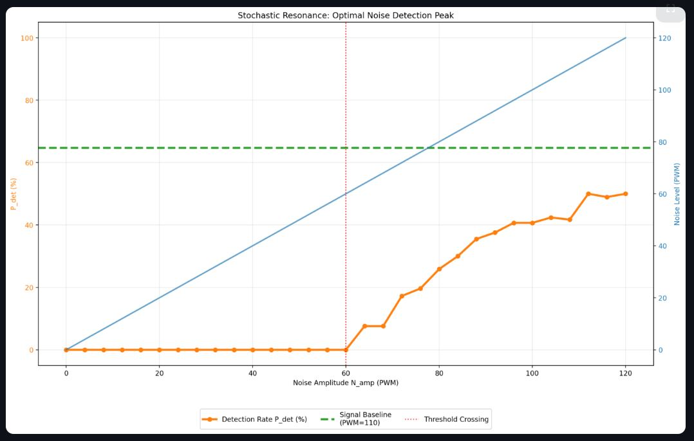
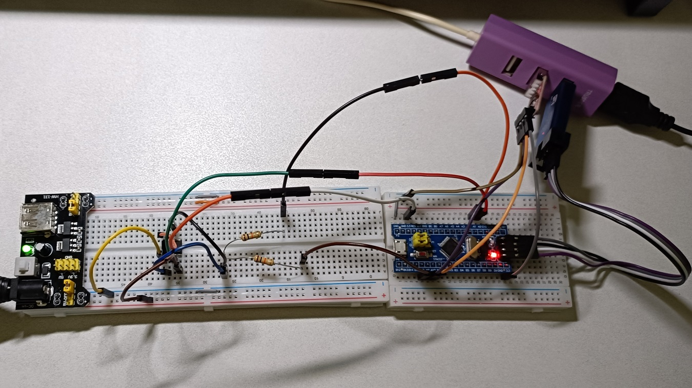
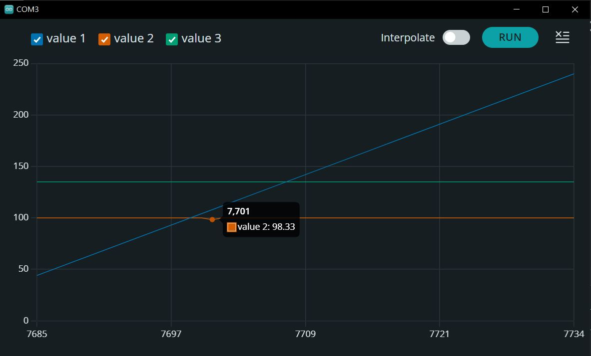

## 🔬 Quantum-Scale Stochastic Resonance (QSR) Simulator

### 1. Problem Statement

In traditional digital systems, a signal is lost if its voltage is lower than the hardware detection threshold (**Sub-threshold**). This project addresses the challenge of recovering this "lost" information without changing the hardware threshold. The goal is to prove that by intentionally injecting **controlled random noise**, we can push a weak signal over the threshold, making it detectable once again.

---

### 2. Step-by-Step Guide

1. **Hardware Assembly**: Build the "Passive Resistor Summer" circuit to mix the signal and noise.
2. **Environment Setup**: Configure Arduino IDE for STM32 and ensure communication via CP2102 (Serial1) and ST-Link (Upload).
3. **Static Calibration**: Set a signal base level (Green Line) that is high but remains below the NE555's trigger point (2.2V).
4. **Noise Scanning**: Gradually increase the noise amplitude (Blue Line) and observe the reaction.
5. **Data Visualization**: Use the Serial Plotter to identify the "Resonance Zone" where the detection rate (Orange Line) begins to climb from 0% to 100%.

**Simulation Code**: [_Here_](./Simulation_Quantum-Scale_Stochastic_Resonance(QSR).py)
- Simulation Result:  


---

### 3. Wiring Diagram

| Component | STM32 Pin | Connection Point | Purpose |
| --- | --- | --- | --- |
| **Signal Source** | **PA8** | 10KΩ Resistor  **Node A** | Weak target signal |
| **Noise Source** | **PA1** | 10KΩ Resistor  **Node A** | Controlled noise injection |
| **NE555 Input** | **Pin 2 & 6** | **Node A** | Combined Input (Signal + Noise) |
| **Detection Feed** | **PA0** | **NE555 Pin 3** | Feedback to STM32 |
| **Communication** | **PA9 (TX)** | **CP2102 (RX)** | Data transmission to PC |
| **Common Rail** | **VCC/GND** | 3.3V / GND | Shared power for all components |

Wiring Picture:  


---

### 4. Final Optimized Code

This code features real-time calibration and high-sample statistics for smooth probability curves.

```cpp
#define SIGNAL_PIN PA8   
#define NOISE_PIN  PA1   
#define DETECT_PIN PA0   

int signal_val = 135; // Calibration sweet spot discovered in PoC

void setup() {
  Serial1.begin(115200); 
  pinMode(SIGNAL_PIN, OUTPUT);
  pinMode(NOISE_PIN, OUTPUT);
  pinMode(DETECT_PIN, INPUT);
  Serial1.println("Noise_Level,Detection_Probability,Signal_Base"); 
}

void loop() {
  if (Serial1.available() > 0) {
    signal_val = Serial1.parseInt(); // Dynamic tuning via Serial Monitor
  }

  for (int n_amp = 0; n_amp <= 220; n_amp += 4) {
    int hit_count = 0;
    int trials = 200; // High trials for smooth "Stochastic" data

    for (int i = 0; i < trials; i++) {
      analogWrite(SIGNAL_PIN, signal_val); 
      analogWrite(NOISE_PIN, random(0, n_amp));
      delayMicroseconds(350); 
      
      if (digitalRead(DETECT_PIN) == HIGH) {
        hit_count++;
      }
      
      analogWrite(SIGNAL_PIN, 0);
      analogWrite(NOISE_PIN, 0);
      delayMicroseconds(150);
    }

    // Output to Serial Plotter
    Serial1.print(n_amp);           // Blue Line: Noise intensity
    Serial1.print(",");
    Serial1.print((float)hit_count / trials * 100); // Orange Line: % Detection
    Serial1.print(",");
    Serial1.println(signal_val);    // Green Line: Signal baseline
  }
}

```

**Serial Plot:**  


---

### 5. Project Q&A

**Q: What exactly does the Green Line represent?**
**A:** It represents your **Signal Baseline**. It is a steady voltage that is "too weak" to be detected on its own. In a quantum system, this would be a qubit state that hasn't reached the measurement threshold.

**Q: Why does the Orange Line go up when the Blue Line (Noise) increases?**
**A:** Because the noise provides the "missing energy." When a random peak in the noise (Blue) adds to the signal (Green), the combined voltage hits the **Hidden Threshold** (2/3 VCC), causing the NE555 to trigger. The Orange line counts how often this happens.

**Q: Why is this called "Resonance"?**
**A:** Because there is an "optimal" amount of noise. Too little noise, and the signal never triggers. Too much noise, and the noise itself triggers the sensor even without a signal. The "sweet spot" in the middle is where the signal-to-noise ratio is maximized for detection.

**Q: Is the NE555 threshold adjustable?**
**A:** In this hardware setup, the threshold is fixed internally at . However, you "adjust" the experiment by changing the `signal_val` to get closer or further from that fixed ceiling.