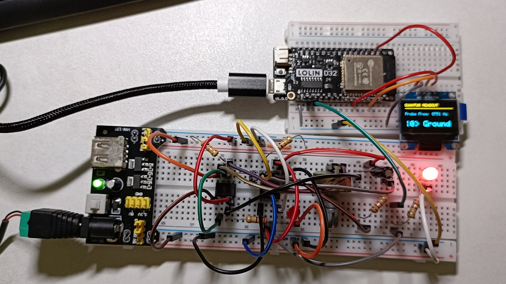

## 🧪 Analog Quantum Dispersive Readout Simulator

### 1. Project Overview

This project establishes a macro-scale model using classical electronic components to simulate the **"Non-destructive Measurement"** (Quantum Non-Demolition) mechanism used in superconducting quantum computers. We implement **Dispersive Readout**, where the state of a qubit is inferred indirectly by measuring the frequency shift of a coupled resonator.

**Core Objectives:**

* **Physical Analogy:** Use NE555 oscillators to simulate a "Qubit" and a "Readout Resonator."
* **Technical Validation:** Demonstrate that the state of System A can shift the frequency of System B via capacitive coupling, allowing for non-contact readout.

Toy Model: [_Code_](Analog_Quantum_Dispersive_Readout_Simulator.py)

---

### 2. Analogy Mapping: Quantum vs. Analog

| Quantum Concept | Analog Circuit Component | Mechanism Analogy |
| --- | --- | --- |
| **Qubit** | **NE555 #1 (Target)** | **Source**: Qubit energy levels |
| **Readout Resonator** | **NE555 #2 (Probe)** | **Detector**: A stable oscillator that "feels" the presence of the Qubit. |
| **Coupling ($g$)** | **1uF Capacitor** | **Interaction**: Establishes a link between systems. Modifying capacitance adjusts coupling strength ($g$), though it also shifts the baseline resonant frequency ($\omega_r$). It functions by injecting charge into Pin 5 (Control Voltage). |
| **Dispersive Shift ($\chi$)** | **Freq Shift via Pin 5** | **Observable**: Qubit state changes cause the resonator frequency to shift ($\omega_r \pm \chi$). |
| **Readout Line** | **ESP32 GPIO 2** | **Instrument**: External device used to analyze the frequency. |
| **Control/Drive** | **1MΩ Potentiometer** | **Operation**: Manually flipping the "state" of the Qubit. |

---

### 3. Wiring Guide

#### **A. Target (Qubit) - NE555 #1**

* **Power**: Pin 8/4 to 5V, Pin 1 to GND.
* **Timing Components**:
* VCC → **10KΩ Resistor** → Pin 7.
* Pin 7 → **1MΩ Potentiometer** → Pin 6.
* Pin 6 → **10uF Electrolytic Cap** → GND.
* Short Pin 2 and Pin 6.


* **Visual**: Pin 3 → 220Ω Resistor → LED 1 → GND.

#### **B. Probe (Resonator) - NE555 #2**

* **Power**: Pin 8/4 to 5V, Pin 1 to GND.
* **Timing Components (High Freq)**:
* VCC → **10KΩ Resistor** → Pin 7.
* Pin 7 → **2.2KΩ Resistor** → Pin 6.
* Pin 6 → **0.1uF Ceramic Cap (104)** → GND.
* Short Pin 2 and Pin 6.


* **Coupling Point**: **Pin 5 (Control Voltage)** receives the coupling capacitor.
* **Visual**: Pin 3 → 220Ω Resistor → LED 2 → GND.

#### **C. Coupling & ESP32 Control**

* **Dispersive Link**: Connect a **1uF Ceramic Capacitor** between **NE555 #1 Pin 3** and **NE555 #2 Pin 5**.
* **Data Acquisition**: Connect **NE555 #2 Pin 3** to **ESP32 GPIO 2**.
* **OLED Display**: SDA to **GPIO 21**, SCL to **GPIO 22** (for ESP32).

---

### 4. Step-by-Step Procedure

1. **Independent Testing**: Assemble NE555 #1 first. Verify LED 1 blinks and changes speed with the potentiometer.
2. **Establish Carrier**: Assemble NE555 #2. LED 2 should appear solid (blinking too fast for the human eye).
3. **Link the Systems**: Insert the 1uF coupling capacitor. The baseline voltage of NE555 #2 will now be perturbed by #1's output.
4. **Calibrate Logic**: Use the ESP32 Serial Monitor to observe frequency and define your threshold (e.g., 8950Hz, trial-error value) to distinguish |0> and |1>.

---

### 5. Implementation Code (Arduino/C++)

```cpp
#include <Wire.h>
#include <Adafruit_GFX.h>
#include <Adafruit_SSD1306.h>

// OLED Hardware Setup
#define SCREEN_WIDTH 128
#define SCREEN_HEIGHT 64
#define OLED_RESET    -1
#define SCREEN_ADDRESS 0x3C 
Adafruit_SSD1306 display(SCREEN_WIDTH, SCREEN_HEIGHT, &Wire, OLED_RESET);

// Standard ESP32 I2C Pins
#define I2C_SDA 21
#define I2C_SCL 22

// Frequency Input Pin
#define SIGNAL_PIN 2

// Timing and Counting Variables
volatile uint32_t pulseCounter = 0;
float currentFrequency = 0;
unsigned long lastSampleTime = 0;

// Interrupt Service Routine
void IRAM_ATTR handlePulse() {
  pulseCounter++;
}

void setup() {
  Serial.begin(115200);

  // Initialize I2C for Standard ESP32
  Wire.begin(I2C_SDA, I2C_SCL);

  // Initialize OLED
  if(!display.begin(SSD1306_SWITCHCAPVCC, SCREEN_ADDRESS)) {
    Serial.println(F("OLED Connection Failed"));
    for(;;); 
  }
  
  display.clearDisplay();
  display.setTextColor(SSD1306_WHITE);
  display.setTextSize(1);
  display.setCursor(0, 10);
  display.println("Quantum Simulator");
  display.display();

  // Initialize Signal Input
  pinMode(SIGNAL_PIN, INPUT_PULLUP);
  attachInterrupt(digitalPinToInterrupt(SIGNAL_PIN), handlePulse, RISING);
  
  lastSampleTime = millis();
}

void loop() {
  unsigned long now = millis();
  
  // Sample frequency every 1 second
  if (now - lastSampleTime >= 1000) {
    // Atomic read and reset of the pulse counter
    noInterrupts();
    uint32_t countSnapshot = pulseCounter;
    pulseCounter = 0;
    interrupts();
    
    currentFrequency = countSnapshot; 
    lastSampleTime = now;

    // --- CALIBRATED LOGIC FOR YOUR CIRCUIT ---
    static String lastState = "|0> Ground";
    
    if (currentFrequency > 8950) {
      lastState = "|1> Excited";
    } else if (currentFrequency < 8910) {
      lastState = "|0> Ground";
    }

    // Refresh OLED Display
    display.clearDisplay();
    
    display.setTextSize(1);
    display.setCursor(0, 0);
    display.println("QUANTUM READOUT");
    display.drawLine(0, 12, 128, 12, SSD1306_WHITE);

    display.setCursor(0, 22);
    display.print("Probe Freq: ");
    display.print(currentFrequency, 0);
    display.println(" Hz");

    display.setCursor(0, 45);
    display.setTextSize(2);
    display.println(lastState);
    
    display.display();

    // Serial Debug
    Serial.printf("Freq: %.0f Hz | State: %s\n", currentFrequency, lastState.c_str());
  }
}
```

**Results**  
| ground state | excited state |
| --- | --- |
|  |  |

---

### 6. Technical Q&A

**Q: Why can the NE555 detect such tiny shifts?**
The **Pin 5 (Control Voltage)** of the NE555 is internally set to $2/3 V_{cc}$ by a voltage divider. Injecting even a small signal (0.1V - 0.2V) via the coupling capacitor changes the threshold at which the internal comparator flips. This directly alters the output frequency at Pin 3, a process known as **Voltage-Controlled Oscillation (VCO)**.

**Q: How does this map to Quantum Dispersive Readout?**
In a quantum system, a qubit's state (|0> or |1>) shifts the resonance frequency of the readout cavity ($\omega_r$) by a value of $\pm \chi$.

$$\omega_{readout} = \omega_r \pm \chi \sigma_z$$

In the circuit:

* **NE555 #1 Frequency** mimics $\sigma_z$ (the qubit state).
* **NE555 #2 Output** mimics the cavity resonance $\omega_r$.
* **The Frequency Shift** detected by the ESP32 mimics the dispersive shift used to read real qubits.