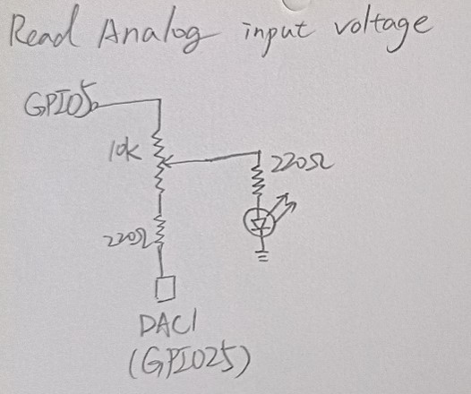
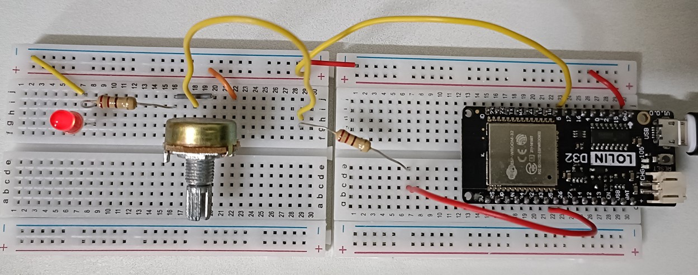

# Analog Input Voltage

Use a DAC pin to read the voltage value,and check the brightness change of LED light


# Components
* ESP32 WeMos LOLIN D32
* USB
* Breadboard
* wires
* 1 unit of LED
* 2 unit of 220Ω
* 1 unit of Potentiometer

# Wiring


# Code
* use GPIO5 as a power source
* analogRead function to read binary code

```C++
int GPIO_pin = 5; //GPIO5 as voltage source
int DAC1_pin = 25; //DAC1 as analog input voltage meter

void setup() {
  // put your setup code here, to run once:
  Serial.begin(115200);
  pinMode(GPIO_pin, OUTPUT);
}

void loop() {
  // put your main code here, to run repeatedly:
  digitalWrite(GPIO_pin,HIGH);
  int dac1_value=analogRead(DAC1_pin);
  Serial.print("DAC value : ");
  Serial.print((dac1_value*3.3)/4095); //convert the binary code into voltage
  Serial.println(" V");
  delay(2000);
}
/*
Output:
as tuning the potentiometer, the voltage changes.
DAC value : 1.73 V
DAC value : 1.71 V
DAC value : 1.64 V
DAC value : 1.75 V
DAC value : 2.09 V
DAC value : 3.30 V
DAC value : 2.30 V
DAC value : 2.18 V
*/
```
