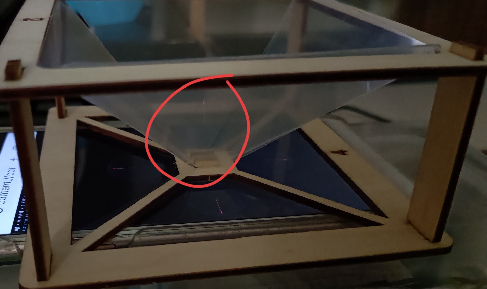

## 🔬 Blochsphere-on-Hand: A Sensor-Based Interactive Holographic Projection

In quantum mechanics, the state of a qubit is not simply **0** or **1** — it can be represented as a **unit vector on the surface of the Bloch sphere**.

**DEMO**: <video src="./V_Blochsphere-on-Hand_A_Sensor-Based_Interactive_Holographic_Projection.mp4" controls="controls" style="max-width: 730px;">
</video>

### 1. Coordinate Mapping

- **Physical Principle**:  
  The Bloch sphere defines a state using two angles:  
  **θ** — the angle with the Z-axis, determining the probability amplitudes of **|0⟩** and **|1⟩**;  
  **φ** — the phase angle in the XY plane.  
- **Project Implementation**:  
  We map the **attitude of the MPU6050 six-axis sensor** to these two angles.  
- **Pitch angle (θ)**:  
  When the sensor points straight up, it represents **|0⟩**;  
  level (horizontal) represents a **superposition state**;  
  pointing straight down represents **|1⟩**.  
- **Yaw/Roll angle (φ)**:  
  Represents the **relative phase** of the quantum state.

### 2. Quantum Gate Operations

- **Physical Principle**:  
  Quantum gates are matrix operations that cause the state vector to rotate on the sphere’s surface.  
  For example, the **Hadamard (H) gate** rotates **|0⟩** to the equatorial line, creating a superposition state.  
- **Project Implementation**:  
  When a button is pressed, the ESP32 calculates the current state matrix and enforces a transformation (e.g., a rotation). This state change is then visualized through a holographic projection.

### 3. Measurement and Collapse

- **Physical Principle**:  
  When we "measure" a qubit in superposition, it collapses to **|0⟩** or **|1⟩** according to its probability distribution.  
- **Project Implementation**:  
  When the "Measure" button is pressed, if the state is near the equator, you have a 50/50 chance of seeing the holographic arrow snap upward (**|0⟩**) or downward (**|1⟩**).
    
    

***

## 🔌 Hardware Wiring Diagram

| Component | ESP32 Pin | Description |
|------------|------------|--------------|
| **MPU6050 VCC** | 3.3V | Power |
| **MPU6050 GND** | GND | Ground |
| **MPU6050 SCL** | GPIO 22 | I2C clock line |
| **MPU6050 SDA** | GPIO 21 | I2C data line |
| **Button (Measure)** | GPIO 14 | Connected to GND (pulldown) |

***

## 🛠️ Step-by-Step Implementation Guide

### Phase 1: Basic Sensing and Coordinate Calculation

1. **Install Libraries**:  
   In Arduino IDE, install `Adafruit MPU6050` and `Adafruit SSD1306`.
2. **Read Euler Angles**:  
   Write a program to read acceleration data from the MPU6050 and compute tilt angles.
3. **Convert Angles to Radians**:  
   Convert them into the range (0 → π). The phone screen should now show the current **θ** value and the probability of **|0⟩** or **|1⟩**.

***

### Phase 2: Holographic Display Communication

1. **Launch WebServer**:  
   On the ESP32, enable `WiFi.softAP` mode to create a hotspot named **"Qubit_Project_AP"**.  
2. **Set Up WebSockets**:  
   Use the `WebSocketsServer` library to broadcast **θ** and **φ** values several times per second.  
3. **Create a Mobile Webpage**:  
   Make a simple HTML file with four `Canvas` elements.  
   Use `Three.js` to draw a 3D arrow, with four camera views (front, back, left, right).

***

### Phase 3: Quantum Logic and Measurement

1. **Implement Measurement Algorithm**:  
   When **Button** is pressed:  
   - Generate a random float `r` between 0 and 1.  
   - If `r < P(0)`, the result is **|0⟩**, else **|1⟩**.  
   - Send a special `"Collapse"` command to the mobile client, making the holographic arrow vibrate and then point to the final state.

***

### Phase 4: Physical Assembly (Holographic Projector)

1. **Build the Pyramid**:  
   Cut four isosceles trapezoids from a transparency sheet and tape them together into a pyramid.  
2. **Set Up the Light Source**:  
   Lay your phone flat with the pyramid’s tip pointing downward at the center of the screen.  
3. **Sync Test**:  
   Rotate the breadboard-mounted MPU6050 and watch the holographic arrow move in sync with your hand motion.

***

### Implementation Code (C++)

```cpp
#include <WiFi.h>
#include <WebSocketsServer.h>
#include <Adafruit_MPU6050.h>
#include <Adafruit_Sensor.h>
#include <Wire.h>

Adafruit_MPU6050 mpu;
WebSocketsServer webSocket = WebSocketsServer(81);

// --- Added: Button configuration ---
const int buttonPin = 14;  // Define the measurement button pin (GPIO 14)
int lastButtonState = HIGH; // Record the previous button state (default HIGH)

unsigned long lastUpdate = 0;
const long interval = 50; // 20Hz update rate

void setup() {
  Serial.begin(115200);

  // --- Added: Initialize button ---
  // Use INPUT_PULLUP mode:
  // When not pressed → HIGH (3.3V)
  // When pressed → connected to GND, becomes LOW (0V)
  pinMode(buttonPin, INPUT_PULLUP);

  if (!mpu.begin()) {
    Serial.println("Failed to find MPU6050");
    while (1) { delay(10); }
  }

  mpu.setAccelerometerRange(MPU6050_RANGE_2_G);
  mpu.setFilterBandwidth(MPU6050_BAND_21_HZ);

  WiFi.softAP("Qubit_Project_AP", "password123");
  webSocket.begin();
  Serial.println("Ready! Button on GPIO 14.");
}

void loop() {
  webSocket.loop();
  unsigned long now = millis();

  // --- Added: Button monitoring logic ---
  int currentButtonState = digitalRead(buttonPin);

  // Detect button *press moment* (Falling edge): from HIGH → LOW
  if (lastButtonState == HIGH && currentButtonState == LOW) {
    Serial.println("Button Pressed! Sending MEASURE...");
    webSocket.broadcastTXT("MEASURE"); // Send special command to the phone
    delay(200); // Simple debounce delay to avoid multiple triggers per press
  }
  lastButtonState = currentButtonState;

  // --- Original: Sensor data transmission ---
  if (now - lastUpdate >= interval) {
    sensors_event_t a, g, temp;
    mpu.getEvent(&a, &g, &temp);

    // Send X, Y, Z accelerometer data
    String data = String(a.acceleration.x) + "," + 
                  String(a.acceleration.y) + "," + 
                  String(a.acceleration.z);
    webSocket.broadcastTXT(data);
    lastUpdate = now;
  }
}
```

### Holographic Projection Code

```html
<!DOCTYPE html>
<html lang="en">
<head>
    <meta charset="UTF-8">
    <title>Quantum Qubit 3D Hologram - Measurement Mode</title>
    <style>
        body { margin: 0; background-color: black; overflow: hidden; display: flex; justify-content: center; align-items: center; height: 100vh; width: 100vw; }
        
        #hologram-grid {
            position: relative;
            width: 100vw;
            height: 100vw;
            display: grid;
            grid-template-columns: 1fr 1fr 1fr;
            grid-template-rows: 1fr 1fr 1fr;
        }

        .view-container { width: 100%; height: 100%; overflow: hidden; display: flex; justify-content: center; align-items: center; }
        
        #view-top    { grid-area: 1 / 2 / 2 / 3; transform: rotate(180deg); }
        #view-left   { grid-area: 2 / 1 / 3 / 2; transform: rotate(90deg); }
        #view-right  { grid-area: 2 / 3 / 3 / 4; transform: rotate(270deg); }
        #view-bottom { grid-area: 3 / 2 / 4 / 3; transform: rotate(0deg); }

        #labels { position: absolute; top: 10px; left: 10px; color: #00ffff; font-family: 'Courier New', monospace; z-index: 10; line-height: 1.5; }
        .equation { font-size: 20px; color: #fff; text-shadow: 0 0 10px #00ffff; }
        .stat-tag { font-size: 12px; color: #555; }
        #msg-box { color: #ff0055; font-weight: bold; font-size: 18px; }
    </style>
    <script src="https://cdnjs.cloudflare.com/ajax/libs/three.js/r128/three.min.js"></script>
</head>
<body>
    <div id="labels">
        <div class="equation" id="dirac">|ψ⟩ = α|0⟩ + β|1⟩</div>
        P(0): <span id="p0">--</span>% | P(1): <span id="p1">--</span>%<br>
        <div id="msg-box"></div>
        <span class="stat-tag">Socket: <span id="status">Connecting...</span></span>
    </div>

    <div id="hologram-grid">
        <div id="view-top" class="view-container"></div>
        <div id="view-left" class="view-container"></div>
        <div id="view-right" class="view-container"></div>
        <div id="view-bottom" class="view-container"></div>
    </div>

    <script>
        let scenes = [], cameras = [], renderers = [], qubitVectors = [];
        const viewIds = ['view-top', 'view-left', 'view-right', 'view-bottom'];
        
        // Quantum state variables
        let isCollapsed = false;
        let lastP0 = 0.5;

        function initHologram() {
            if (typeof THREE === 'undefined') {
                document.getElementById('status').innerText = "ERROR: Three.js not loaded!";
                return;
            }

            const size = window.innerWidth / 3;

            viewIds.forEach((id) => {
                const container = document.getElementById(id);
                const scene = new THREE.Scene();
                const camera = new THREE.PerspectiveCamera(45, 1, 0.1, 100);
                camera.position.z = 3;

                const renderer = new THREE.WebGLRenderer({ antialias: true, alpha: true });
                renderer.setSize(size, size);
                container.appendChild(renderer.domElement);

                // Bloch sphere wireframe
                const sphere = new THREE.Mesh(
                    new THREE.SphereGeometry(1, 16, 16),
                    new THREE.MeshBasicMaterial({ color: 0x004444, wireframe: true, transparent: true, opacity: 0.3 })
                );
                scene.add(sphere);

                // Qubit state vector (initially pointing up to |0⟩)
                const vector = new THREE.ArrowHelper(new THREE.Vector3(0, 1, 0), new THREE.Vector3(0, 0, 0), 1, 0x00ffff);
                scene.add(vector);

                scenes.push(scene); cameras.push(camera); renderers.push(renderer); qubitVectors.push(vector);
            });
            animate();
            connectWebSocket();
        }

        function animate() {
            requestAnimationFrame(animate);
            // Slowly rotate Bloch spheres for visual effect
            scenes.forEach((scene) => {
                scene.children[0].rotation.y += 0.01; 
            });
            renderers.forEach((r, i) => r.render(scenes[i], cameras[i]));
        }

        function connectWebSocket() {
            const socket = new WebSocket(`ws://192.168.4.1:81`);
            const statusBox = document.getElementById('status');
            const msgBox = document.getElementById('msg-box');

            socket.onopen = () => statusBox.innerText = "Connected";
            
            socket.onmessage = (event) => {
                // 1. Identify measurement command
                if (event.data === "MEASURE") {
                    handleMeasurement();
                    return;
                }

                // If currently displaying collapse result, temporarily ignore position updates
                if (isCollapsed) return;

                const coords = event.data.split(',');
                if (coords.length < 3) return;

                let ax = parseFloat(coords[0]);
                let ay = parseFloat(coords[1]);
                let az = parseFloat(coords[2]);

                // 2. Update 3D qubit vectors in all four views
                let newDir = new THREE.Vector3(ax, az, ay).normalize();
                qubitVectors.forEach(v => v.setDirection(newDir));

                // 3. Update probabilities and Dirac notation
                let p0_val = ((az / 9.8) + 1) / 2;
                lastP0 = Math.max(0, Math.min(1, p0_val)); // Store globally for measurement use
                
                let p0_percent = (lastP0 * 100).toFixed(0);
                let alpha = Math.sqrt(lastP0).toFixed(2);
                let beta = Math.sqrt(1 - lastP0).toFixed(2);

                document.getElementById('p0').innerText = p0_percent;
                document.getElementById('p1').innerText = 100 - p0_percent;
                document.getElementById('dirac').innerText = `|ψ⟩ = ${alpha}|0⟩ + ${beta}|1⟩`;
            };
        }

        function handleMeasurement() {
            isCollapsed = true;
            const msgBox = document.getElementById('msg-box');
            
            // Determine result based on current probability (God plays dice)
            let result = Math.random() < lastP0 ? 0 : 1;
            
            // Visual effect: Force vector to pole position
            let targetDir = result === 0 ? new THREE.Vector3(0, 1, 0) : new THREE.Vector3(0, -1, 0);
            qubitVectors.forEach(v => {
                v.setColor(0xff0055); // Vector turns red during collapse
                v.setDirection(targetDir);
            });

            msgBox.innerText = `MEASURED: |${result}⟩ !`;
            
            // Return to normal after 2 seconds
            setTimeout(() => {
                isCollapsed = false;
                msgBox.innerText = "";
                qubitVectors.forEach(v => v.setColor(0x00ffff));
            }, 2000);
        }

        window.onload = initHologram;
    </script>
</body>
</html>
```
