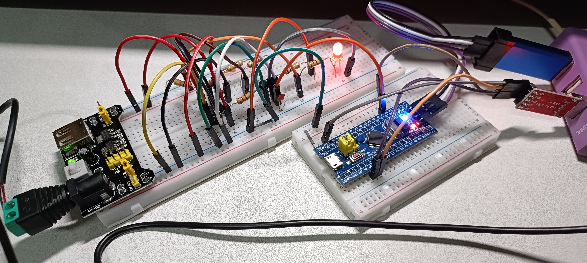
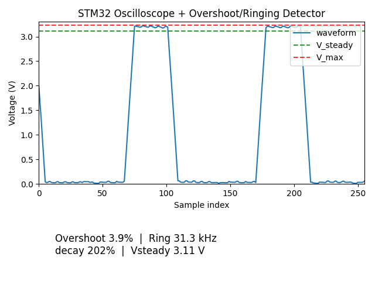

## **Project Title**: "Overshoot & Ringing Detector with STM32 Blue Pill as an Oscilloscope"

***

### **📋 Wiring Description**

### **1. NE555 Astable Oscillator Circuit**
NE555 8-pin IC (notch/dot facing left, Pin 1 is bottom right):

- **Pin 1 (GND)**: Connect to breadboard ground rail
- **Pin 8 (VCC)**: Connect to 5V power rail
- **Pin 4 (RESET)**: Connect to 5V power rail
- **Pin 2 (TRIGGER)**: Connect directly to Pin 6 with short jumper wire
- **Pin 6 (THRESHOLD)**: 
  - Connect one leg of 0.1µF (50V) capacitor, other capacitor leg to ground rail
  - Connect one end of 9.1kΩ resistor, other end of 9.1kΩ to 8.2kΩ resistor, connect other end of 8.2kΩ to Pin 7
- **Pin 7 (DISCHARGE)**: 
  - Connect one end of 10kΩ resistor, other end to 5V power rail
- **Pin 5 (CONTROL)**: Connect 0.01µF (50V) capacitor to ground rail (recommended for stability)
- **Pin 3 (OUTPUT)**: Connect one end of 2.2kΩ resistor (base resistor for transistor)

### **2. 2N2222 NPN Transistor + LED Load + Probe Point**
2N2222 transistor (flat side facing you: Left=Base, Middle=Collector, Right=Emitter):

- **Emitter (right pin)**: Connect directly to ground rail
- **Base (left pin)**: Connect to other end of 2.2kΩ resistor from NE555 Pin 3
- **Collector (middle pin)** - This is your **MAIN PROBE NODE** with 4 connections:

```
Connection A: 5V power rail → 220Ω resistor → LED anode (long leg) → LED cathode (short leg) → 2N2222 Collector

Connection B: 2N2222 Collector → 0.1µF (50V) capacitor → ground rail (parasitic capacitance for ringing)

Connection C: 2N2222 Collector → 10kΩ resistor → ground rail (voltage divider)
                                        ↓
                               Connect here → STM32 PA0

Connection D: STM32 PA0 also connects to junction between 10kΩ resistor and ground
```

### **3. STM32 Blue Pill Connections**
```
STM32 Blue Pill pins:
- PA0 → Junction of 10kΩ resistor and ground (from collector voltage divider)
- PA9 (USART1_TX) → CP2102 RX pin  
- GND → Breadboard ground rail
- 3.3V and GND powered by ST-LINK V2 USB connection

CP2102 USB-TTL module:
- USB connector → PC (provides COM port)
- GND → Breadboard ground rail
```



***

## **⚙️ STM32CubeMX Configuration**
[_Configuration_](./CubeMX__Overshoot_and_Ringing_Detector_with_STM32_as_Oscilloscope.pdf)

[_STM32Code_](./STM32_Overshoot_and_Ringing_Detector_with_STM32_as_Oscilloscope.cpp)

***

## **Waveform Drawing**
[_pythonscript_](Drawing_Overshoot_and_Ringing_Detector_with_STM32_as_Oscilloscope.py)

***

## **Result**


***

To reduce overshoot and ringing in your current NE555 → 2N2222 → LED + 0.1 µF + 10 kΩ divider → STM32 PA0 setup, you can improve things in three main ways: shorten the loop, add damping, and make the probe node more stable.

## 1. Shorten high‑di/dt and ground loops

Around the 2N2222 collector loop (5 V → 220 Ω → LED → collector → GND) and the path from collector to the 0.1 µF capacitor, any long wire acts as extra inductance and increases ringing.

Suggestions:
- Place the **LED, 220 Ω resistor, 2N2222, and 0.1 µF capacitor physically close together** on the breadboard, using the shortest possible jumpers (ideally < 2–3 cm).
- Connect the **bottom of the 0.1 µF capacitor directly to a ground point very close to the transistor**, not through a long ground run.
- Keep the STM32 PA0 wire as short as possible, and route it away from the heavy LED current loop so it acts only as a measurement line.

## 2. Add damping in the collector path

Right now the 0.1 µF is directly from collector to ground, which is effectively a “pure capacitor” load. Together with wiring inductance this forms an under‑damped LC that easily rings.

You can try:

- **Series damping resistor in front of the 0.1 µF** (classic RC snubber style):  
  - Change to: Collector → 22–33 Ω → 0.1 µF → GND.  
  - This resistor adds loss to the LC and lowers the Q, reducing ringing amplitude.

- **Increase series resistance in the LED path**:  
  - Currently: 5 V → 220 Ω → LED → collector.  
  - If brightness allows, replace 220 Ω with 330–470 Ω. This reduces peak current and makes edges a bit slower and less “aggressive,” which usually reduces overshoot.

- If you only need “some” overshoot to measure, you can reduce the capacitor value (e.g., 0.1 µF → 10–22 nF). That shifts ringing to higher frequency and typically reduces visible amplitude on your STM32‑level bandwidth.

## 3. Make the divider / probe node less resonant

The STM32 is connected at the midpoint of the divider: collector → 10 kΩ → GND, PA0 at the junction. That 10 kΩ is both a load and part of the measurement network.

Options:

- Lower the divider resistor a bit so the node has lower impedance and acts as a light resistive load on high‑frequency ripple:  
  - Try 10 kΩ → 4.7 kΩ or 3.3 kΩ to ground. The STM32 input current is tiny, so this is still safe, but the extra loading can help damp ringing slightly.

- If you want STM32 to disturb the circuit even less (for more “ideal” measurement), you can use a symmetric divider:  
  - Collector → 10 kΩ → node → 10 kΩ → GND, PA0 at the node.  
  - This gives 20 kΩ total load to the collector, lighter than your current single 10 kΩ. This reduces loading but may not reduce ringing; it’s more about measurement transparency.

## 4. Improve supply decoupling

Even at low frequency, NE555 and 2N2222 edge currents can shake the 5 V rail and ground, indirectly affecting overshoot.

- Add **0.1 µF in parallel with 10 µF** between NE555 VCC and GND, placed close to the NE555 pins.
- Your STM32 3.3 V rail from ST‑LINK is fine, but also add a **10 µF electrolytic near the 5 V USB module output** to stiffen that rail.

## Two highest‑impact changes to try first

If you want minimum changes to see a clear effect:

1. **Add a series damping resistor before the 0.1 µF**:  
   - Collector → 22–33 Ω → 0.1 µF → GND.

2. **Physically shorten and tighten the entire collector loop layout** (LED, 220 Ω, transistor, 0.1 µF all close together, short ground).

After these changes, your Python tool (overshoot %, ringing kHz, decay %) should show:
- Overshoot percentage decreasing slightly.
- Ringing amplitude and/or decay ratio improving (faster decay, smaller residual).