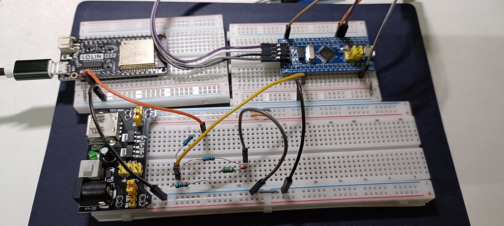

# ESP32 + STM32 RLC Qubit Analog Lab

## Purpose

* To simulate the three core concepts of a superconducting LC qubit using an RLC circuit: **"Resonance Frequency," "Decoherence,"** and **"Rabi Drive,"** allowing to perform actual quantum hardware control flows.
* The **ESP32** generates PWM drive pulses (corresponding to microwave pulses), and the **STM32** acts as a custom oscilloscope to measure the response (corresponding to qubit readout).
* Built entirely with off-the-shelf components, emphasizing the complete quantum experimental chain: **"Waveform generation → Qubit → Readout → Data analysis."**

## Physics Background

1. **LC Qubit Analog**
* Ideal LC: $ω_0 = 1/\sqrt{LC}$, corresponding to the eigenfrequency of a Transmon qubit or cavity.
* While a Transmon qubit is essentially a nonlinear oscillator (Josephson L + Capacitor C), this project uses a linear LC circuit for a fundamental analogy.

2. **Damping and Decoherence**
* Series/parallel resistance around the LC causes energy dissipation, leading to an exponential decay of the oscillation envelope (T1-like relaxation time).
* In this lab’s wiring, **larger R_damp gives weaker effective damping and longer observed T1; smaller R_damp gives stronger damping and shorter T1.**
* Experimentally: R = 1k → fast decay; R = 10k → medium; R = 100k → slow decay.

3. **Rabi Drive Analog**
* Near-resonance AC drive: Amplitude rises linearly with pulse duration, analogous to "Rotation angle = $\Omega \times t$" ($\Omega$ = Rabi frequency).
* Although a linear LC circuit lacks Bloch oscillations, it qualitatively demonstrates gate operation concepts.

## Components List

| Component | Specification | Qty | Usage/Function |
| --- | --- | --- | --- |
| **L** | 100 µH (1/4W 100µH) | 1 | Qubit Inductor |
| **C** | 0.01 µF (50V) | 1 | Qubit Capacitor |
| **R_damp** | 1k, 10k, 100k Ω | 1 ea | Damping (T1 control) |
| **R_drive** | 220 Ω | 1 | ESP32 Current Limiting |
| **R_probe** | 10 kΩ | 1 | STM32 Voltage Divider |
| **ESP32** | ESP32/ESP32-C3 | 1 | PWM Drive Source |
| **STM32** | Blue Pill F103C8T6 | 1 | ADC Oscilloscope |

**Resonance Frequency Table:**
| C Value |  (kHz) |
| :--- | :--- |
| 0.01 µF | 5.03 |

## Wiring Diagram



### RLC Qubit Core Circuit:

```text
Q-node ── R_damp(1k/10k/100k) ── L(100uH) ── C(0.01uF) ── GND
       │
       ├── 220Ω ── ESP32 GPIO2 (PWM Output)
       └── 10kΩ ── GND
            ↑
        STM32 PA0 (ADC1_IN0) connects here

```

### Control and Measurement:

```text
ESP32:
- GPIO2 → 220Ω → Q-node
- GND → Breadboard Ground Rail
- Power via Micro-USB

STM32 Blue Pill:
- PA0 → Midpoint of 10kΩ voltage divider (Between Q-node and GND)
- PA9 (TX) → CP2102 RX → PC
- Power via ST-LINK V2 (3.3V/GND → Ground Rail)

```

**Wiring Highlights:**

1. **Q-node** is the top of the series RLC circuit (Common point for Drive + Probe).
2. STM32 PA0 connects to the junction of the 10kΩ resistor and GND (This acts as a 1/2 voltage divider, ensuring safety < 3.3V).
3. **All GNDs must share a common ground** to avoid ground loops.
4. Keep ESP32/STM32 probe wires **< 10cm** to minimize parasitic inductance.

## Step-by-Step Guide

### Step 1: Calculation and RLC Assembly

1. Select $L=100µH$, $C=0.01µF$. Calculate $f_0 = 1/(2\pi\sqrt{LC}) \approx 5kHz$.
2. Connect $R_{damp}$ (start with 10k) → $L$ → $C$ in series on the breadboard, grounding the bottom end.
3. Connect ESP32 GPIO2 → 220Ω → Q-node; Connect the STM32 PA0 voltage divider probe.

### Step 2: Frequency Sweep (Analog Qubit Spectroscopy)

1. ESP32 Program: PWM sweep from 2.5kHz to 10kHz ($0.5f_0 \sim 2f_0$).
2. **STM32 Oscilloscope:** Captures the waveform; Python calculates the amplitude at the Q-node for each frequency.
3. Observation: Amplitude is maximized when $f \approx f_0$ (qubit on-resonance); amplitude is low when deviated (detuning).
4. Plot: "Frequency vs. Amplitude," fit a Lorentzian peak to find $f_0$ and the linewidth.

### Step 3: Damping Test (T1 Decoherence)

1. Fix PWM frequency at  with a 50% duty cycle.
2. Swap $R_{damp}$ with 1k, 10k, and 100k, and repeat Step 2.
3. Observation: Observe changes in peak width/height.
4. Free Decay: Turn off PWM after a short pulse. STM32 captures the decay waveform. Fit exp(-t/τ) to extract T1 and compare how the decay rate changes for different Rdamp values.

### Step 4: Rabi Drive (Gate Pulse)

1. Fix PWM frequency = $f_0$.
2. Vary pulse duration (10ms ~ 100ms). Read the maximum Q-node amplitude after each pulse.
3. **Observation:** The longer the pulse, the larger the steady-state amplitude, analogous to **"Rotation Angle  Pulse Duration."**
4. **Plot:** "Pulse Duration vs. Amplitude." Explain that the linear LC circuit acts like "half a Rabi cycle."

### Step 5: Data Analysis and Display

1. **Python Processing:** Process STM32 UART data to generate:
* Frequency Sweep → Resonance Curve
* Decay → T1 vs R Curve
* Rabi → Pulse Response

2. **Optional**: Add an OLED/LCD1602 to display "Qubit Energy" in real-time (Amplitude is analogous to $|1\rangle$ probability).

## Observation and Summary
[_Result_](./Summary_ESP32+STM32_RLC_Qubit_Analog_Lab.md)

## ESP32 Arduino Code Example

```cpp
/*
ESP32 RLC Qubit Driver for STM32 Oscilloscope (ESP32 Core v3.x Compatible)
Quantum Analog Lab Project
*/

#define PWM_GPIO      2      // GPIO2 -> 220R -> Q-node
#define PWM_RES_BITS  8      // 8-bit resolution (0-255) 
#define DUTY_50       128    // 50% duty for 8-bit

// Target resonance frequency (L=100uH, C=0.01uF -> ~5033 Hz)
#define F0_TARGET     5033

// Frequency sweep parameters
#define F_START       2500   // 2.5 kHz (0.5 f0)
#define F_END         10000  // 10 kHz (2 f0) 
#define F_STEP        250    // 250 Hz steps
#define SWEEP_MS      2000   // 2 seconds per frequency

// Rabi pulse parameters
#define PULSE_MIN_MS  10
#define PULSE_MAX_MS  100
#define PULSE_STEP_MS 10

void setup() {
  Serial.begin(115200);
  delay(1000);
  
  Serial.println();
  Serial.println("ESP32 RLC Qubit Driver (Core v3.x API)");
  Serial.printf("Target f0: ~%d Hz\n", F0_TARGET);
  
  // Disable built-in LED to avoid interference
  pinMode(LED_BUILTIN, INPUT);
  
  // Initial PWM setup using v3.x API
  bool success = ledcAttach(PWM_GPIO, F0_TARGET, PWM_RES_BITS);
  if (!success) {
    Serial.println("ERROR: ledcAttach failed! Check pin/freq/resolution.");
    while(1);  // Halt on error
  }
  Serial.println("ledcAttach successful.");
  
  // Start with PWM OFF
  ledcWrite(PWM_GPIO, 0);
  delay(500);
}

void loop() {
  // ========== MODE 1: Continuous Drive at f0 ==========
  Serial.println();
  Serial.println("=== MODE 1: Continuous drive at f0 ===");
  Serial.println("PWM ON at f0, 50% duty - capture steady-state with STM32");
  ledcAttach(PWM_GPIO, F0_TARGET, PWM_RES_BITS);
  ledcWrite(PWM_GPIO, DUTY_50);
  delay(10000);  // 10 seconds for observation
  ledcWrite(PWM_GPIO, 0);
  delay(1000);

  // ========== MODE 2: Frequency Sweep (qubit spectroscopy) ==========
  Serial.println();
  Serial.println("=== MODE 2: Frequency sweep 0.5 f0 ~ 2 f0 ===");
  for (int freq = F_START; freq <= F_END; freq += F_STEP) {
    bool success = ledcAttach(PWM_GPIO, freq, PWM_RES_BITS);
    if (!success) {
      Serial.printf("Freq %d Hz: ledcAttach FAILED\n", freq);
      continue;
    }
    Serial.printf("Freq: %4d Hz - capture %d ms with STM32\n", freq, SWEEP_MS);
    ledcWrite(PWM_GPIO, DUTY_50);
    delay(SWEEP_MS);
    ledcWrite(PWM_GPIO, 0);
    delay(500);
  }

  // ========== MODE 3: Rabi Pulse Length Sweep ==========
  Serial.println();
  Serial.println("=== MODE 3: Rabi pulse length sweep at f0 ===");
  ledcAttach(PWM_GPIO, F0_TARGET, PWM_RES_BITS);
  for (int pulse_ms = PULSE_MIN_MS; pulse_ms <= PULSE_MAX_MS; pulse_ms += PULSE_STEP_MS) {
    Serial.printf("Pulse: %3d ms at f0 - trigger STM32 capture\n", pulse_ms);
    ledcWrite(PWM_GPIO, DUTY_50);
    delay(pulse_ms);
    ledcWrite(PWM_GPIO, 0);
    delay(2000);  // 2s for decay observation + STM32 capture
  }

  // ========== MODE 4: Free Decay Test (T1 measurement) ==========
  Serial.println();
  Serial.println("=== MODE 4: Free decay test (T1) ===");
  ledcAttach(PWM_GPIO, F0_TARGET, PWM_RES_BITS);
  for (int trial = 0; trial < 3; trial++) {
    Serial.printf("Free decay trial %d: 50ms pulse -> OFF\n", trial + 1);
    ledcWrite(PWM_GPIO, DUTY_50);
    delay(50);  // Short excitation pulse
    ledcWrite(PWM_GPIO, 0);
    Serial.println("PWM OFF - capture decay envelope with STM32");
    delay(5000);  // 5s decay observation
  }

  Serial.println();
  Serial.println("=== Cycle complete - restarting in 5 seconds ===");
  delay(5000);
}
```