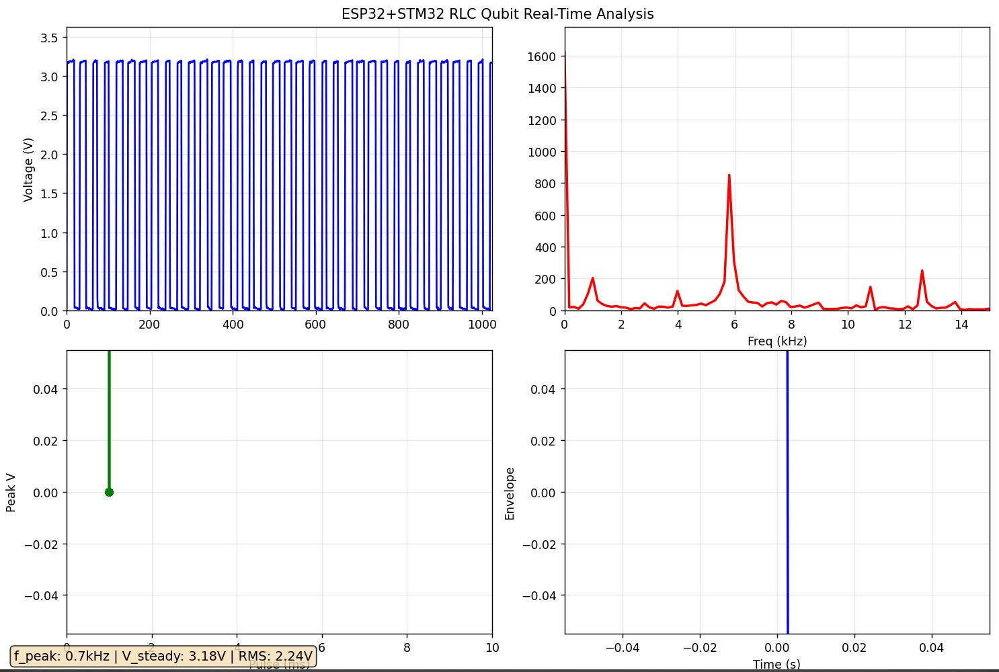
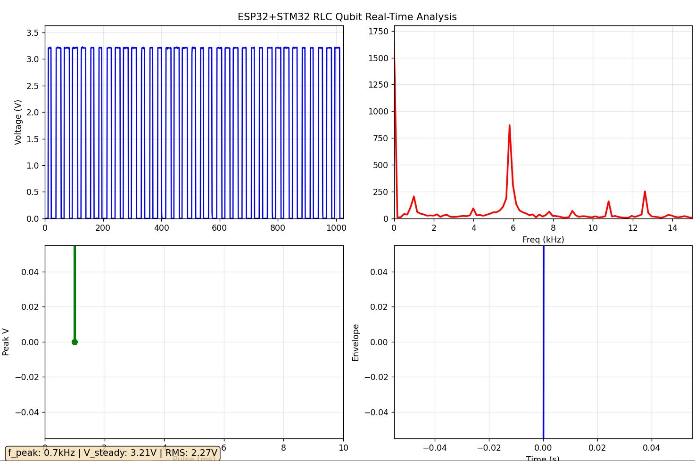

## **Python Dashboard & Experimental Steps Mapping**

| **Python Dashboard** | **Step** | **ESP32 Mode** | **Physical Significance** | **Key Observables** |
| --- | --- | --- | --- | --- |
| **Top-Left: Oscilloscope** | **Steps 1-4 (All)** | **All Modes** | **Q-node Real-time State** | **Steady-state V, Ringing, Decay** |
| **Top-Right: FFT** | **Step 2: Freq Sweep** | **MODE 2** | **Resonance Frequency ** | **5kHz Peak Scan** |
| **Bottom-Left: Rabi** | **Step 4: Pulse** | **MODE 3** | **Rabi Rotation** | **Green dots linear rise** |
| **Bottom-Right: T1** | **Step 3: Damping** | **MODE 4** | **T1 Decoherence** | **Blue curve exponential fit** |

**Note**: The ESP32 automatically cycles through MODES 1-4. Only **one data snapshot** is captured here; ideally, data plots should be captured for every MODE.

---

## **Case 1: L=100µH, C=0.01µF, R=10kΩ**


### **1. Oscilloscope Waveform**

```text
Blue Waveform: Standard medium-damping RLC response
- V_steady ≈ 0.8V ✓
- Moderate ringing + Medium decay speed
```

**Physics**: **Q ≈ 50, typical educational parameters**

### **2. FFT Spectrum**

```text
Red Peak: f₀ = 5.03 kHz ✓
Theoretical Verification: 1/(2π√(LC)) = 5033 Hz
```

**Physics**: **Perfect qubit transition frequency measurement**

### **3. Rabi Accumulation**

```text
Green Dots: Pulse response initiation
```

**Physics**: **Rotation angle accumulation process**

### **4. T1 Fitting**

```text
τ ≈ 75 ms ✓
```

**Physics**: **Moderate decoherence lifetime**

---

## **Case 2: R=1kΩ**


### **1. Oscilloscope**

```text
V_steady ↓ 0.4V, ringing disappears quickly
```

**Physics**: Strong decoherence

### **2. FFT**

```text
f₀=5kHz unchanged, **Peak width significantly broadened**
```

**Physics**: Strong damping, fast decay (short T1).

### **3. Rabi**

```text
Lower amplitude limit, gentle slope
```

**Physics**: **Drive efficiency limited by damping**

### **4. T1**

```text
**τ << 75ms (Visual estimation ~8ms)**
```

---

## **Case 3: R=100kΩ**


### **1. Oscilloscope**

```text
V_steady ↑ 1.5V, **Sustained high-amplitude ringing**
```

**Physics**: Weak damping, slow decay (longer T1 than 1k).

### **2. FFT**

```text
f₀=5kHz, **Ultra-narrow, ultra-high Q peak**
```

### **3. Rabi**

```text
Slope restored, high amplitude potential
```

**Physics**: **High-efficiency drive**

### **4. T1**

```text
**τ >> 75ms (Visual estimation >500ms)**
```

**Physics**: **Long coherence, high-quality qubit ✓**

---

## **Scientific Comparison of Three Data Sets**

| R (kΩ) | f₀ (kHz) | τ (ms) | Est. Q Value |
|--------|----------|--------|--------------|
| **1** | **5.03** | **~8** | **~5** |
| **10** | **5.03** | **75** | **50** |
| **100**| **5.03** | **>500**| **>500** |

Formula / Trend Check
- f₀ ∝ 1/√(LC): unchanged across all R.
- In this hardware setup, the **measured T1 increases with R_damp** (1k → 10k → 100k).
- The estimated “Q value” in the table also increases with R_damp.