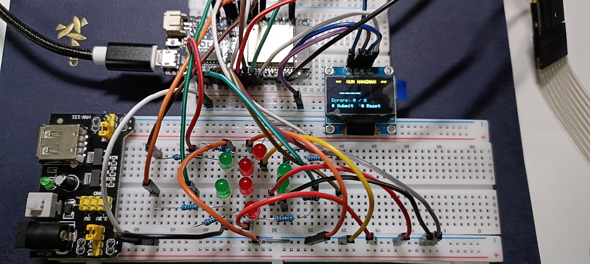

## Project Title - A Number Guessing Hangman Game with ESP32, keypad and LED 

## 🎯 Game Specifications

* **Answer:** The ESP32 randomly generates a 4-digit number (0000–9999, duplicates allowed) for each round.
* **Input:** The player uses the 0–9 numeric keypad to enter 4 digits, then presses the "#" key on the keypad to submit a guess.
* **Reset:** Press the "*" button on the keypad to clear the current game state and generate a new answer.
* Keys "A" ~ "D" on the keypad are idle/unused.
* **Feedback Display:**
  * **Y:** The digit is correct and in the correct position.
  * **B:** The digit is correct but in the wrong position.
  * Example format displayed on the OLED:
```text
Guess:1234
Y=2,B=1
```
* **Hangman Rules:** For every incorrect guess, one body part of the hangman is drawn (an LED lights up). The player has a total of 8 chances. If the 8th chance is used and the answer is still not guessed → the game is Lost.
* Example format displayed on the OLED:

| For winning case | For lose case |
| :--- | :--- |
| WIN | LOSE, ANS = 1234 |

* **Game Over Conditions:** If Y=4 while the number of incorrect guesses is < 8, the player immediately Wins. If incorrect guesses reach 8 and Y is still not 4, the player Loses.

### 🛠️ Hardware Components

| Component | Quantity | Function |
| --- | --- | --- |
| ESP32 DevKit | 1 | Main Controller |
| 4x4 Membrane Keypad | 1 | Player Input |
| SSD1306 OLED | 1 | Display Y/B, Status |
| **LED + 220Ω Resistor** | **8** | **Full Hangman Figure** |

---

## Wiring Diagram



### **1. OLED + Keypad**

```
OLED SSD1306:
VCC → 3V3, GND → GND, SDA → GPIO21, SCL → GPIO22

4x4 Keypad 8-pin (Left→Right):
Pin1 R1 → GPIO19
Pin2 R2 → GPIO18  
Pin3 R3 → GPIO17
Pin4 R4 → GPIO25
Pin5 C1 → GPIO26
Pin6 C2 → GPIO5
Pin7 C3 → GPIO23
Pin8 C4 → GPIO32

```

### **2. 8 Hangman LEDs**

```
GPIO33 ── 220Ω ── Head Left LED   ── GND
GPIO27 ── 220Ω ── Head Right LED  ── GND
GPIO13 ── 220Ω ── Body Left LED   ── GND
GPIO15 ── 220Ω ── Body Right LED  ── GND
GPIO2  ── 220Ω ── Left Arm LED    ── GND
GPIO14 ── 220Ω ── Right Arm LED   ── GND
GPIO4  ── 220Ω ── Left Leg LED    ── GND
GPIO16 ── 220Ω ── Right Leg LED   ── GND

```

### **3. Breadboard Hangman Shape**

```
     ● ●   ← Head (GPIO33,27)
     │ │   ← Body (GPIO13,15)
    ─┼─┼─  ← Arms (GPIO2,14)
     │ │   ← Legs (GPIO4,16)

```

---

## Debug the keypad

Keypad Pin Scanner: Upload the following code, press each physical key, and the Serial Monitor will display the intersecting pins (row and column) for the key you pressed. 

After pressing a key, the Serial Monitor will display: Key at Row2 Col2 (for example). Use this method to determine the corresponding rows and columns on your keypad

```cpp
#include <Keypad.h>

const byte ROWS = 4;
const byte COLS = 4;

char keys[ROWS][COLS] = {
  {'a','b','c','d'}, // Row 0 (R1)
  {'e','f','g','h'}, // Row 1 (R2)
  {'i','j','k','l'}, // Row 2 (R3)
  {'m','n','o','p'}  // Row 3 (R4)
};

// current wiring
byte rowPins[ROWS] = {19, 18, 17, 25}; 
byte colPins[COLS] = {26, 5, 23, 32};

Keypad myKeypad = Keypad(makeKeymap(keys), rowPins, colPins, ROWS, COLS);

void setup() {
  Serial.begin(115200);
  Serial.println("\n=== Keypad Diagnostic Tool ===");
  Serial.println("Press keys on your physical keypad...");
}

void loop() {
  char key = myKeypad.getKey();
  if (key) {
    // find the char in 2d matrix
    int foundR = -1;
    int foundC = -1;
    for (int r = 0; r < ROWS; r++) {
      for (int c = 0; c < COLS; c++) {
        if (keys[r][c] == key) {
          foundR = r;
          foundC = c;
        }
      }
    }
    
    Serial.print("Pressed Key => Received char: '");
    Serial.print(key);
    Serial.print("' | Mapped to: Row[");
    Serial.print(foundR);
    Serial.print("] (GPIO ");
    Serial.print(rowPins[foundR]);
    Serial.print("), Col[");
    Serial.print(foundC);
    Serial.print("] (GPIO ");
    Serial.print(colPins[foundC]);
    Serial.println(")");
  }
}

```

## ESP32 Code

[_Result_](./VerifyANDResult.md)

```cpp
#include <Keypad.h>
#include <Wire.h>
#include <Adafruit_GFX.h>
#include <Adafruit_SSD1306.h>

// ============================================================
//  OLED
// ============================================================
#define SCREEN_WIDTH  128
#define SCREEN_HEIGHT  64
#define OLED_ADDR    0x3C
Adafruit_SSD1306 display(SCREEN_WIDTH, SCREEN_HEIGHT, &Wire, -1);
// ============================================================
//  Keypad 4x4
//  Row: GPIO32, 23, 5, 26   Col: GPIO25, 17, 18, 19
// ============================================================
const byte ROWS = 4, COLS = 4;
char keys[ROWS][COLS] = {
  {'1','2','3','A'},
  {'4','5','6','B'},
  {'7','8','9','C'},
  {'*','0','#','D'}
};
byte rowPins[ROWS] = {32, 23, 5, 26};
byte colPins[COLS] = {25, 17, 18, 19};
Keypad myKeypad = Keypad(makeKeymap(keys), rowPins, colPins, ROWS, COLS);

// ============================================================
//  Hangman LEDs
// ============================================================
#define LED_HEAD_L  33   // mistake 1
#define LED_HEAD_R  27   // mistake 2
#define LED_BODY_L  13   // mistake 3
#define LED_BODY_R  15   // mistake 4
#define LED_HAND_L   2   // mistake 5
#define LED_HAND_R  14   // mistake 6
#define LED_FOOT_L   4   // mistake 7
#define LED_FOOT_R  16   // mistake 8

const int ledOrder[8] = {
  LED_HEAD_L, LED_HEAD_R,
  LED_BODY_L, LED_BODY_R,
  LED_HAND_L, LED_HAND_R,
  LED_FOOT_L, LED_FOOT_R
};
const int MAX_ERRORS = 8;

// ============================================================
//  State Machine  ← GS_ prefix to avoid Arduino/Keypad conflicts
// ============================================================
typedef enum { GS_IDLE, GS_INPUT, GS_RESULT, GS_WIN, GS_LOSE } GameState;
GameState gameState = GS_IDLE;

char answer[5]       = "";
char currentGuess[5] = "";
int  guessLen   = 0;
int  errorCount = 0;
int  lastY = 0, lastB = 0;

// ============================================================
//  Forward Declarations
// ============================================================
void startNewGame();
void evaluateGuess();
void resetLEDs();
void lightLED(int n);
void oledWelcome();
void oledInput();
void oledResult();
void oledWin();
void oledLose();

// ============================================================
//  Setup
// ============================================================
void setup() {
  Serial.begin(115200);

  Wire.begin(21, 22);
  if (!display.begin(SSD1306_SWITCHCAPVCC, OLED_ADDR)) {
    Serial.println("OLED not found! Check wiring / I2C address.");
    for (;;) delay(1000);
  }

  for (int i = 0; i < MAX_ERRORS; i++) {
    pinMode(ledOrder[i], OUTPUT);
    digitalWrite(ledOrder[i], LOW);
  }

  randomSeed(esp_random());

  oledWelcome();
  gameState = GS_IDLE;
  Serial.println("=== Hangman Game Ready ===");
}

// ============================================================
//  Main Loop
// ============================================================
void loop() {
  char key = myKeypad.getKey();
  if (!key) return;

  // A ~ D: idle, ignore
  if (key >= 'A' && key <= 'D') return;

  Serial.printf("[Key] %c  [State] %d\n", key, (int)gameState);

  // * = reset anytime
  if (key == '*') {
    startNewGame();
    return;
  }

  switch (gameState) {

    case GS_IDLE:
      startNewGame();
      break;

    case GS_INPUT:
      if (key >= '0' && key <= '9') {
        if (guessLen < 4) {
          currentGuess[guessLen++] = key;
          currentGuess[guessLen]   = '\0';
          oledInput();
        }
      } else if (key == '#') {
        if (guessLen == 4) evaluateGuess();
        // less than 4 digits: ignore #
      }
      break;

    case GS_RESULT:
      if (key >= '0' && key <= '9') {
        guessLen = 1;
        currentGuess[0] = key;
        currentGuess[1] = '\0';
        gameState = GS_INPUT;
        oledInput();
      } else if (key == '#') {
        guessLen = 0;
        currentGuess[0] = '\0';
        gameState = GS_INPUT;
        oledInput();
      }
      break;

    case GS_WIN:
    case GS_LOSE:
      startNewGame();
      break;
  }
}

// ============================================================
//  Game Logic
// ============================================================
void startNewGame() {
  for (int i = 0; i < 4; i++)
    answer[i] = '0' + (char)random(10);
  answer[4] = '\0';

  guessLen    = 0;
  errorCount  = 0;
  lastY = lastB = 0;
  currentGuess[0] = '\0';

  resetLEDs();
  gameState = GS_INPUT;
  oledInput();

  Serial.printf("[New Game] Answer: %s\n", answer);
}

void evaluateGuess() {
  int Y = 0, B = 0;
  bool usedA[4] = {}, usedG[4] = {};

  // Pass 1: correct digit + correct position => Y
  for (int i = 0; i < 4; i++) {
    if (currentGuess[i] == answer[i]) {
      Y++;
      usedA[i] = usedG[i] = true;
    }
  }
  // Pass 2: correct digit, wrong position => B
  for (int i = 0; i < 4; i++) {
    if (!usedG[i]) {
      for (int j = 0; j < 4; j++) {
        if (!usedA[j] && currentGuess[i] == answer[j]) {
          B++;
          usedA[j] = true;
          break;
        }
      }
    }
  }

  lastY = Y; lastB = B;
  Serial.printf("[Eval] %s -> Y=%d B=%d | Errors: %d\n",
                currentGuess, Y, B, errorCount);

  if (Y == 4) {
    gameState = GS_WIN;
    oledWin();
    return;
  }

  errorCount++;
  lightLED(errorCount);

  if (errorCount >= MAX_ERRORS) {
    gameState = GS_LOSE;
    oledLose();
  } else {
    gameState = GS_RESULT;
    oledResult();
  }
}

void resetLEDs() {
  for (int i = 0; i < MAX_ERRORS; i++)
    digitalWrite(ledOrder[i], LOW);
}

void lightLED(int n) {
  if (n >= 1 && n <= MAX_ERRORS)
    digitalWrite(ledOrder[n - 1], HIGH);
}

// ============================================================
//  OLED Display
// ============================================================
void oledWelcome() {
  display.clearDisplay();
  display.setTextColor(SSD1306_WHITE);

  display.setTextSize(1);
  display.setCursor(10, 0);
  display.println("==  NUM HANGMAN  ==");

  display.setCursor(0, 16);
  display.println("Guess the 4-digit");
  display.println("number!");

  display.setCursor(0, 38);
  display.println("  # = Submit guess");
  display.println("  * = Reset / New game");

  display.setCursor(20, 56);
  display.println("Press any key...");

  display.display();
}

void oledInput() {
  display.clearDisplay();
  display.setTextColor(SSD1306_WHITE);

  display.setTextSize(1);
  display.setCursor(10, 0);
  display.println("==  NUM HANGMAN  ==");

  display.setTextSize(2);
  display.setCursor(18, 16);
  for (int i = 0; i < guessLen; i++) display.print(currentGuess[i]);
  for (int i = guessLen; i < 4;   i++) display.print('_');

  display.setTextSize(1);
  display.setCursor(0, 42);
  display.print("Errors: ");
  display.print(errorCount);
  display.print(" / ");
  display.print(MAX_ERRORS);

  display.setCursor(0, 55);
  display.print("# Submit   * Reset");

  display.display();
}

void oledResult() {
  display.clearDisplay();
  display.setTextColor(SSD1306_WHITE);

  display.setTextSize(1);
  display.setCursor(20, 0);
  display.println("==  RESULT  ==");

  display.setCursor(0, 14);
  display.print("Guess: ");
  display.println(currentGuess);

  display.setTextSize(2);
  display.setCursor(8, 28);
  display.print("Y="); display.print(lastY);
  display.print("  B="); display.print(lastB);

  display.setTextSize(1);
  display.setCursor(0, 52);
  display.print("Err:");
  display.print(errorCount);
  display.print("/");
  display.print(MAX_ERRORS);
  display.print("  0-9/# to cont.");

  display.display();
}

void oledWin() {
  display.clearDisplay();
  display.setTextColor(SSD1306_WHITE);

  display.setTextSize(3);
  display.setCursor(22, 8);
  display.println("WIN!");

  display.setTextSize(1);
  display.setCursor(8, 44);
  display.print("Solved in ");
  display.print(errorCount);
  display.println(" error(s)");

  display.setCursor(4, 56);
  display.println("Any key = new game");

  display.display();
}

void oledLose() {
  display.clearDisplay();
  display.setTextColor(SSD1306_WHITE);

  display.setTextSize(2);
  display.setCursor(14, 4);
  display.println("LOSE!");

  display.setTextSize(1);
  display.setCursor(0, 32);
  display.print("ANS = ");
  display.println(answer);

  display.setCursor(4, 46);
  display.println("Try again?");
  display.setCursor(4, 56);
  display.println("Any key = new game");

  display.display();
}

```