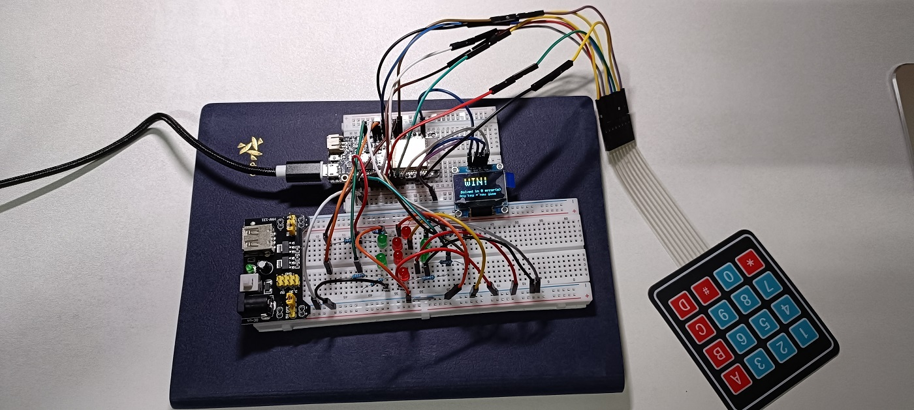
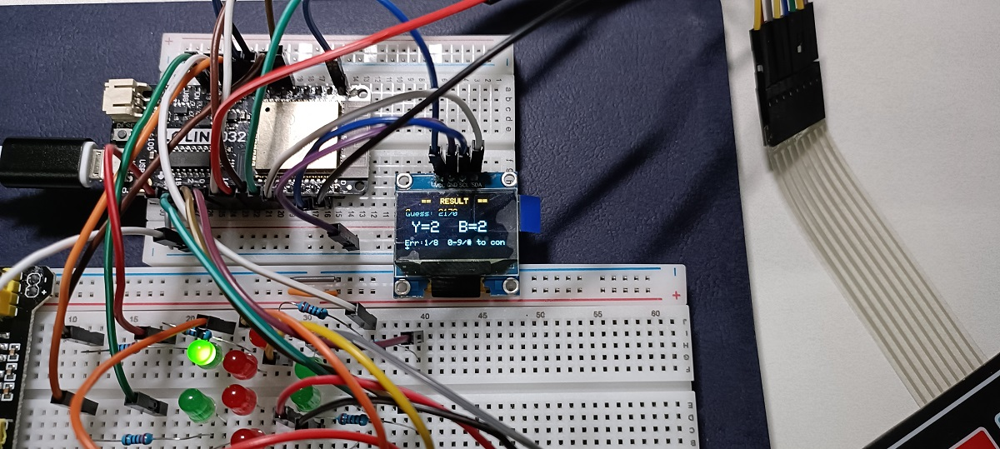
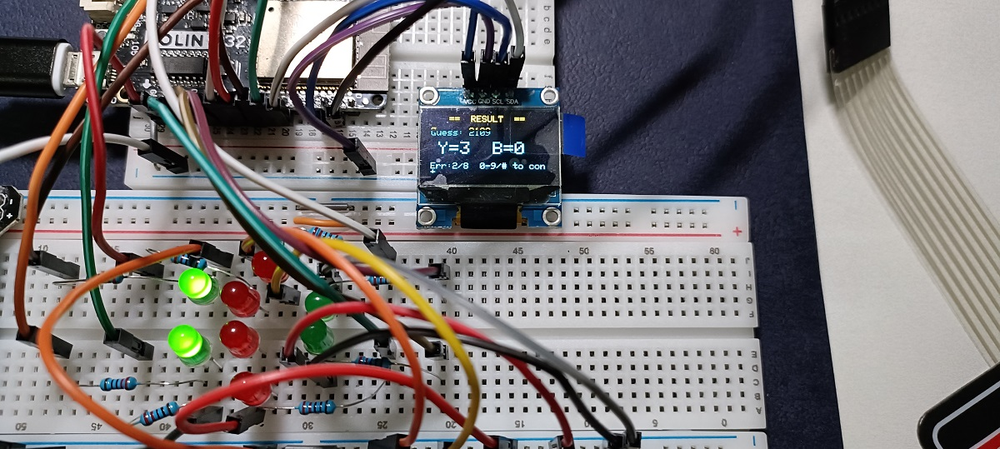
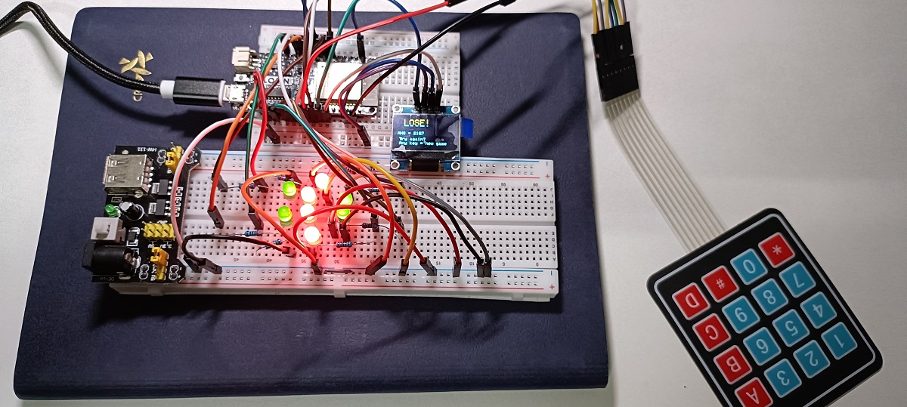
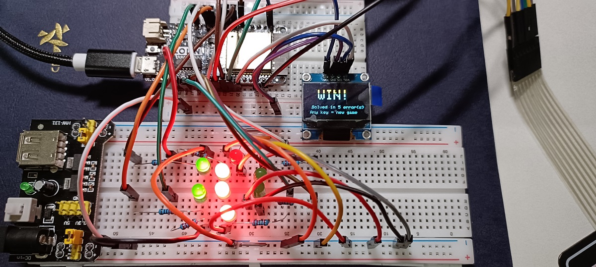

## Ouput and Result

- Win



```text
Monitor
22:07:08.087 -> [Key] #  [State] 0
22:07:08.121 -> [New Game] Answer: 7483
22:07:11.179 -> [Key] 7  [State] 1
22:07:14.666 -> [Key] 4  [State] 1
22:07:15.367 -> [Key] 8  [State] 1
22:07:19.596 -> [Key] 3  [State] 1
22:07:21.166 -> [Key] #  [State] 1
22:07:21.166 -> [Eval] 7483 -> Y=4 B=0 | Errors: 0
```

- Verify




```text
Monitor
22:09:55.896 -> [New Game] Answer: 2107
22:10:05.421 -> [Key] 2  [State] 1
22:10:07.010 -> [Key] 1  [State] 1
22:10:09.016 -> [Key] 7  [State] 1
22:10:09.925 -> [Key] 0  [State] 1
22:10:12.850 -> [Key] #  [State] 1
22:10:12.850 -> [Eval] 2170 -> Y=2 B=2 | Errors: 0
```



```text
Monitor
22:11:07.384 -> [Key] 2  [State] 2
22:11:08.205 -> [Key] 1  [State] 1
22:11:11.847 -> [Key] 0  [State] 1
22:11:12.453 -> [Key] 9  [State] 1
22:11:13.522 -> [Key] #  [State] 1
22:11:13.522 -> [Eval] 2109 -> Y=3 B=0 | Errors: 1
```



```text
Monitor
22:14:29.795 -> [Key] 5  [State] 2
22:14:30.204 -> [Key] 5  [State] 1
22:14:30.544 -> [Key] 5  [State] 1
22:14:31.405 -> [Key] 7  [State] 1
22:14:32.090 -> [Key] #  [State] 1
22:14:32.090 -> [Eval] 5557 -> Y=1 B=0 | Errors: 7
```

Verify-2



```text
22:15:15.266 -> [New Game] Answer: 0010
22:15:21.837 -> [Key] 1  [State] 1
22:15:22.239 -> [Key] 2  [State] 1
22:15:22.694 -> [Key] 3  [State] 1
22:15:23.709 -> [Key] 4  [State] 1
22:15:24.471 -> [Key] #  [State] 1
22:15:24.471 -> [Eval] 1234 -> Y=0 B=1 | Errors: 0
22:15:31.045 -> [Key] 1  [State] 2
22:15:32.365 -> [Key] 7  [State] 1
22:15:32.889 -> [Key] 8  [State] 1
22:15:33.492 -> [Key] 9  [State] 1
22:15:34.253 -> [Key] #  [State] 1
22:15:34.253 -> [Eval] 1789 -> Y=0 B=1 | Errors: 1
22:15:40.004 -> [Key] 0  [State] 2
22:15:40.974 -> [Key] 1  [State] 1
22:15:45.140 -> [Key] 1  [State] 1
22:15:45.478 -> [Key] 1  [State] 1
22:15:46.245 -> [Key] #  [State] 1
22:15:46.245 -> [Eval] 0111 -> Y=2 B=0 | Errors: 2
22:15:50.089 -> [Key] 0  [State] 2
22:15:50.817 -> [Key] 1  [State] 1
22:15:51.730 -> [Key] 9  [State] 1
22:15:52.142 -> [Key] 9  [State] 1
22:15:52.698 -> [Key] #  [State] 1
22:15:52.698 -> [Eval] 0199 -> Y=1 B=1 | Errors: 3
22:16:02.421 -> [Key] 0  [State] 2
22:16:04.383 -> [Key] 0  [State] 1
22:16:05.442 -> [Key] 0  [State] 1
22:16:05.739 -> [Key] 0  [State] 1
22:16:06.248 -> [Key] #  [State] 1
22:16:06.248 -> [Eval] 0000 -> Y=3 B=0 | Errors: 4
22:16:08.389 -> [Key] 0  [State] 2
22:16:08.767 -> [Key] 0  [State] 1
22:16:09.421 -> [Key] 1  [State] 1
22:16:10.273 -> [Key] 0  [State] 1
22:16:10.929 -> [Key] #  [State] 1
22:16:10.929 -> [Eval] 0010 -> Y=4 B=0 | Errors: 5
```