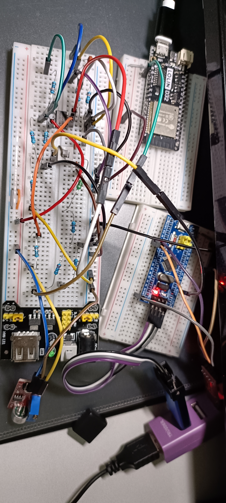
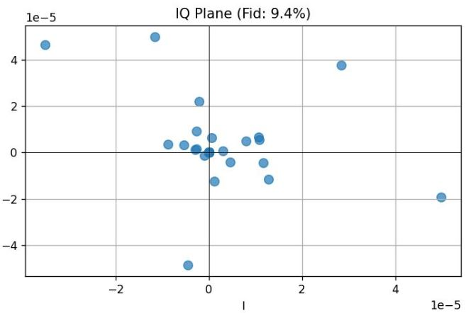
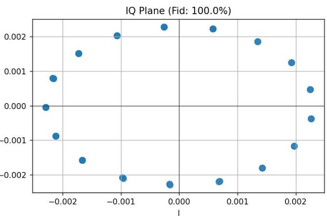

# Project Title - Quantum Readout Fidelity with Analogy Experiment

## Project Objective

To fully implement a signal processing chain mimicking a superconducting quantum computer: **"Readout Pulse → RLC Resonant Cavity → LM358 Dual-Stage Amplification Chain → STM32 High-Speed ADC."** An ESP32 is used to precisely control readout pulse parameters (width $t_p$, energy $E_p$).

**Core Experiment**: **No Noise vs. With Noise** comparison. This quantifies the destruction of IQ demodulation fidelity caused by environmental noise (KY-037 microphone), establishing a complete relationship curve of **"Noise → SNR → Fidelity."**

---

## Hardware Wiring



### 1. Power Supply

* **Voltage Converter Module**: 5V USB → Breadboard Red Rail (+5V).
* **Common Rail**: All +5V components connect to the red rail; all GND components connect to the blue ground rail.
* **ESP32**: VIN → +5V, GND → Ground Rail.
* **STM32**: Powered by ST-LINK V2 (3.3V), shared common ground.

### 2. ESP32 PWM Drive

* **Wiring**: ESP32 GPIO2 (PWM) → 220Ω resistor → RLC Q-node.
* **Interface**: ESP32 USB → PC Serial Monitor (Commands: `t_p`, `e_p`, `run`).

| Command | Parameter | Physical Significance |
| --- | --- | --- |
| **t_p** | Readout Pulse Width ($\mu s$) | Sets the duration of the pulse. Longer pulses accumulate more energy in the cavity (improving SNR) but may cause decoherence or non-linearity. |
| **e_p** | Readout Pulse Energy | Sets the intensity via PWM Duty Cycle or DAC amplitude. Analogous to injected microwave power (e.g., -123dBm). High energy risks "cavity overdrive." |
| **run** | Execute Readout | Triggers the pulse. The signal travels through the RLC and LM358 chain to be captured by the STM32 for IQ demodulation and Fidelity calculation. |

### 3. RLC Resonant Cavity (0/1 State Switchable)

**Circuit Layout**:

* Q-node — $R_{damp}$ (10kΩ, swappable with 1k/100k) — L (100uH) — C (0.01uF) — GND.
* **Drive**: ESP32 GPIO2 enters Q-node via 220Ω resistor.
* **Measurement**: 10kΩ voltage divider midpoint at Q-node leads to the amplification chain.
* **0/1 State Switching**: Use a DIP switch to parallel a 0.1uF capacitor with the 0.01uF capacitor at the Q-node to shift the resonance frequency.

### 4. LM358 Dual-Stage Amplification Chain

**First Stage Op-amp (Pins 1-3, HEMT Analogy)**:

* Q-node divider point → LM358 Pin 3 (IN+).
* LM358 Pin 2 (IN-) → 10kΩ → GND.
* LM358 Pin 1 (OUT) → 100kΩ → Pin 2 (Gain = $1 + 100k/10k \approx 11$).
* **Noise Injection**: KY-037 A0 (Analog Out) → 100kΩ → LM358 **Pin 2** (Disconnect for "No Noise").

**Second Stage Op-amp (Pins 5-7, TWPA Analogy)**:

* LM358 Pin 1 → 0.1uF capacitor → Pin 5 (IN+).
* Pin 6 (IN-) → 10kΩ → GND.
* Pin 7 (OUT) → 100kΩ → Pin 6 (Gain $\approx 11$).

### 5. STM32 Readout (Acting as Digitizer/Oscilloscope)

* **Signal Scaling**: LM358 Pin 7 → 10kΩ → Midpoint → 10kΩ → GND.
* **ADC Input**: Voltage divider midpoint → **STM32 PA0** (ADC1_CH0).
* **Data Transfer**: STM32 PA9 (TX) → CP2102 (USB-to-UART) → PC UART.

---

## Noise / No-Noise Switching

* **No Noise**: KY-037 A0 output is disconnected or floating.
* **With Noise**: KY-037 A0 → 100kΩ → LM358 Pin 2.
* **Low Noise**: Quiet environment.
* **Medium Noise**: Speaking or placing near a phone speaker.
* **High Noise**: Tapping the breadboard or placing near a buzzer.


> **Note**: Use 3.3V for KY-037 VCC if the noise signal saturates the LM358.

---

## Operational Workflow

1. **Serial Monitor → ESP32**: Input parameters for `t_p`, `e_p`, then `run`.
2. **Signal Path**: ESP32 generates PWM → RLC Cavity → LM358 Chain → STM32 PA0.
3. **Data Processing**: STM32 DMA sampling → UART → Python (Waveform + FFT + IQ Analysis).
4. **Fidelity Analysis**: Toggle KY-037 noise and compare the resulting fidelity.

**Expected Results**:

* **Fidelity**: No Noise (~95%) → High Noise (~45%).
* **Visuals**: Python plots showing IQ scatter plot diffusion and SNR degradation curves.

---

## ESP32 Code
```cpp
/*
 * ESP32 Readout Pulse Driver for
 * "Quantum Readout Fidelity with analogy experiment"
 *
 * GPIO2: PWM output -> 220R -> RLC Q-node
 * Serial commands:
 *   t_p  <us>   : set pulse width in microseconds
 *   e_p  <0-100>: set pulse energy (duty %) 0~100
 *   run        : fire one readout pulse
 *   repeat <N> : fire N pulses with small gap
 */

#include <Arduino.h>

// PWM settings
const int PWM_GPIO     = 2;
const int PWM_FREQ_HZ  = 5000;     // 5 kHz
const int PWM_RES_BITS = 8;        // 8-bit

// Pulse parameters
uint32_t t_p_us   = 100;
uint8_t  e_p_pct  = 50;

// Apply duty (0-255)
void applyDuty() {
  uint32_t duty = (uint32_t)e_p_pct * ((1 << PWM_RES_BITS) - 1) / 100;
  ledcWrite(PWM_GPIO, duty);
}

// Fire single pulse
void fire_pulse() {
  applyDuty();
  delayMicroseconds(t_p_us);
  ledcWrite(PWM_GPIO, 0);
  Serial.printf("[PULSE] t_p=%lu us, E_p=%d%%\n", t_p_us, e_p_pct);
}

// Command parser
void handleCommand(const String &cmdLine) {
  String cmd = cmdLine;
  cmd.trim();
  if (cmd.length() == 0) return;

  int spaceIdx = cmd.indexOf(' ');
  String key = cmd;
  String val;
  if (spaceIdx > 0) {
    key = cmd.substring(0, spaceIdx);
    val = cmd.substring(spaceIdx + 1);
    val.trim();
  }
  key.toLowerCase();

  if (key == "t_p") {
    long v = val.toInt();
    if (v < 1) v = 1; if (v > 500000) v = 500000;
    t_p_us = v;
    Serial.printf("[SET] t_p=%lu us\n", t_p_us);
  } else if (key == "e_p") {
    long v = val.toInt();
    if (v < 0) v = 0; if (v > 100) v = 100;
    e_p_pct = v;
    Serial.printf("[SET] E_p=%d%%\n", e_p_pct);
  } else if (key == "run") {
    Serial.println("[RUN]");
    fire_pulse();
  } else if (key == "repeat") {
    long N = val.toInt();
    if (N < 1) N = 1; if (N > 1000) N = 1000;
    Serial.printf("[REPEAT] %ld\n", N);
    for (long i = 0; i < N; i++) {
      fire_pulse();
      if (i < N-1) delay(5);
    }
    Serial.println("[DONE]");
  } else if (key == "?") {
    Serial.println("t_p <us>  e_p <0-100>  run  repeat <N>  ?");
  } else {
    Serial.printf("[?] %s\n", cmd.c_str());
  }
}

void setup() {
  Serial.begin(115200);
  delay(2000);

  // ===== ESP32 Core 3.3.7 SINGLE CALL API =====
  ledcAttach(PWM_GPIO, PWM_FREQ_HZ, PWM_RES_BITS);
  ledcWrite(PWM_GPIO, 0);

  Serial.println("\n=== ESP32 Readout v5 ===");
  Serial.printf("5kHz PWM on GPIO%d\n", PWM_GPIO);
  Serial.printf("t_p=%lu us, E_p=%d%% | ? help\n", t_p_us, e_p_pct);
}

void loop() {
  static String line = "";
  while (Serial.available()) {
    char c = Serial.read();
    if (c == '\r' || c == '\n') {
      handleCommand(line);
      line = "";
    } else {
      line += c;
    }
  }
}

```

---
## Results

*[Python code for plotting data](./Plot_Setup_Quantum_Readout_Fidelity_with_Analogy_Experiment.py)*

| With Noise | Without Noise |
| --- | --- |
|  |  |

---

## Q&A

### 1. Pulse Parameter Effects on Readout Fidelity

#### **$t_p$ (Pulse Width) Impact**

* **Physical meaning**: Readout pulse duration ($\mu s$).
* **Effect on RLC resonator**: Energy accumulation time.
* **$t_p \uparrow$ Effects**:
   * ✅ More energy accumulated in RLC cavity → Larger IQ amplitude → Higher Fidelity.
   * ❌ Exceeds threshold → Cavity nonlinearity/decay → Fidelity drops.


* **$t_p$ limit**:
   * Physical limits: $t_p \uparrow \rightarrow$ RLC ring-down time $\rightarrow$ Decoherence equivalent.
   * Why? Longer pulses cause the RLC to enter a nonlinear regime, LM358 op-amp saturation, or IQ demodulation failure (signal looks like a square wave rather than a sine wave).

#### **$e_p$ (Pulse Energy/Duty Cycle) Impact**

* **Physical meaning**: PWM duty cycle (0-100%).
* **Effect on ESP32 GPIO2**: Instantaneous drive power.
* **$e_p \uparrow$ Effects**:
   * ✅ Higher drive amplitude → Stronger initial RLC excitation.
   * ✅ Larger IQ constellation radius → Higher Fidelity.


* **Practical limits**: Even though monotonic, $e_p$ is capped by GPIO voltage (3.3V) and the hardware limits of the LM358 input and cavity power handling.

### 2. With or Without Noise comparison

* **No Noise**: Clean readout pulse → RLC sinusoidal response → LM358 linear amplification. **IQ Demodulation**: Stable ring (normal phase drift). **Fidelity ~100%**: All samples exceed the dynamic threshold.
* **With Noise**: KY-037 injects environmental noise into LM358 first stage (IN-). **IQ Demodulation**: Noise dominates → The IQ ring collapses toward the origin. **Fidelity ~9.4%**: Only a few samples barely exceed the threshold.

### 3. Why does Fidelity 100% show a full ring, while 10% shows a collapsed ring?

**Core Principle**: SNR determines the IQ distribution shape.

* **High SNR (Fidelity ~100%) → Full Ring**: Each pulse sample has a slight phase difference $\Delta \phi$ between the ESP32 and STM32. The IQ points follow $(r \cdot \cos(\phi), r \cdot \sin(\phi))$. Since $r$ is constant and $\phi$ rotates, it forms a **complete ring**. Fidelity is 100% because the radius $r$ of all 32 points is above the threshold.
* **Low SNR (Fidelity ~10%) → Collapsed Ring**: The signal component is very weak ($r \approx 0.002V$), while the noise component is of the same magnitude ($noise_{rms} \approx 0.001V$). The resulting vectors point in random directions with a tiny radius, causing the ring to **collapse into the origin**.
