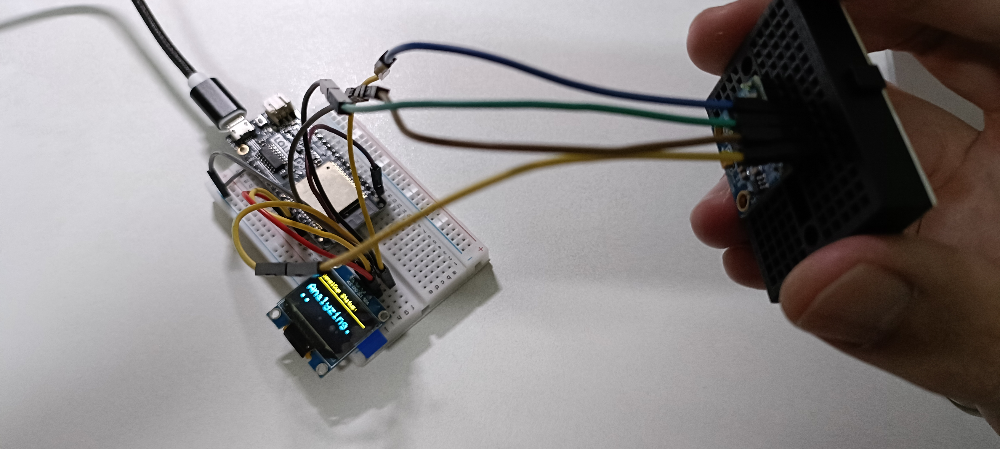
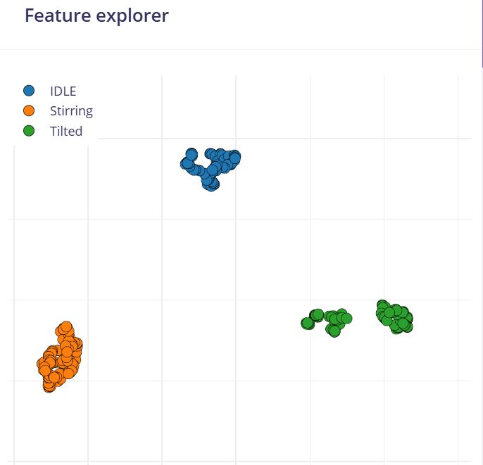
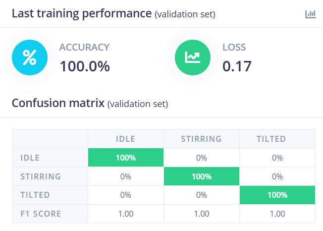
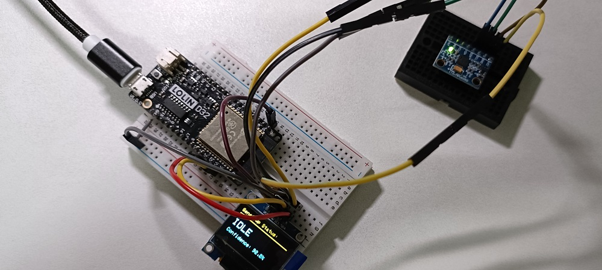
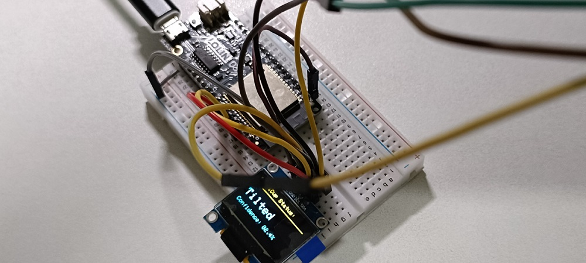

# Action Recognizer Based on Edge Impulse with ESP32 + MPU6050

## Problem Statement
This project explores how to determine motion states or specific user behaviors using only a single 6-axis sensor. By analyzing the vibration and posture changes of the sensor, this edge computing solution utilizes Machine Learning to identify whether the sensor is in a "Stirring," "Drinking(Tilted)", or "Idle" state.

## Objectives
To develop a Machine Learning model capable of real-time classification between Idle, Stirring, and Drinking. The model is deployed to an ESP32 to display the current motion status on an OLED screen while operating offline.

## Wiring
| Component       | VCC  | GND | SDA              | SCL              |
|-----------------|------|-----|------------------|------------------|
| ESP32 (LOLIN)   | 3.3V | GND | GPIO 21          | GPIO 22          |
| MPU6050         | VCC  | GND | Connect to GPIO 21 | Connect to GPIO 22 |
| OLED (SSD1306)  | VCC  | GND | Connect to GPIO 21 | Connect to GPIO 22 |



## Required Materials
- Core Controller: ESP32 Development Board
- Sensor: 6-axis Motion Tracking Sensor (MPU6050)
- Display: OLED Screen (SSD1306)
- Software: Edge Impulse Studio, Arduino IDE

## Step-by-Step Procedures

### Step 01: Hardware Assembly
Connect the ESP32 to the 6-axis sensor via the I2C interface using jumper wires.

### Step 02: Data Acquisition (Critical Step)
Collect the following three categories of data using the MPU6050 and a Python serial script. Each category requires approximately 10 seconds of samples:
- Idle: The sensor remains stationary on a flat surface.
- Stirring: Regularly shaking the sensor (simulating the act of stirring).
- Drinking(Tilted): Tilting the sensor (simulating the act of drinking).

[_Python-Code-for-data-collection_](Python-Code-for-data-collection.py)

```Cpp
// ESP32 Code for capturing MPU6050 data
#include <Adafruit_MPU6050.h>
#include <Adafruit_Sensor.h>
#include <Wire.h>

Adafruit_MPU6050 mpu;

void setup() {
  Serial.begin(115200);
  while (!Serial) delay(10);

  if (!mpu.begin()) {
    while (1) yield();
  }
}

void loop() {
  sensors_event_t a, g, temp;
  mpu.getEvent(&a, &g, &temp);

  Serial.print(a.acceleration.x, 2);
  Serial.print(",");
  Serial.print(a.acceleration.y, 2);
  Serial.print(",");
  Serial.print(a.acceleration.z, 2);
  Serial.println();

  delay(20);
}
```

### Step 03: Digital Signal Processing (DSP)
#### Part 1: Create Impulse
Navigate to the left menu and select Impulse Design -> Create Impulse.

1. Time series data：
    - Window Size: Set to 2000 ms. This determines the observation window for each action state (2 seconds).
    - Window Increase: Set to 80 ms. Using a sliding window approach makes the real-time prediction more responsive.
2. Add a processing block：
    - Click Add and select Spectral Analysis.
    - This is a powerful tool for sensor data processing; it transforms raw, noisy vibration waveforms into frequency-domain data.
3. Add a learning block：
    - Click Add and select Classification.
4. Finally, click Save Impulse.

#### Part 2：Spectral Analysis
Select **Spectral Features** under the Impulse Design menu.

1.  Observe the waveforms for the three axes (**accX, accY, accZ**).
2.  Click **Save parameters** at the top (the default parameters are typically sufficient).
3.  Click **Generate features**.
4.  **Key Observation:** Once the process completes, a **Feature Explorer** (3D scatter plot) will appear on the right. If you see three distinct color clusters, it indicates high-quality data with clear separability between classes.



#### Part 3: Classifier
Click **Classifier** under the **Impulse Design** menu.

1.  **Training Settings:**
    * **Number of Epochs:** Set to **30**.
    * **Learning Rate:** Set to **0.0005**.
2.  Click **Start Training**.
3.  **Evaluate Results:** Once training is complete, review the **Confusion Matrix** at the bottom.
    * An **Accuracy** above **90%** indicates that the model can reliably distinguish between the three different motions. 
    * By selecting **Spectral Analysis** in Edge Impulse, each corresponding action will display unique frequency peaks in the MPU6050's FFT (Fast Fourier Transform) charts.



### Step 04: Deployment
1. Click Deployment from the left-hand menu.
2. In the "Search for a library" section, select Arduino library.
3. Scroll to the bottom and click Build.
4. This will download a .zip file. Open your Arduino IDE, then navigate to Sketch -> Include Library -> Add .ZIP Library to import your model.
* Notes: this step may take longer time depending on CPU or other tasks running in background

## ESP32 code for Action classification
```cpp
#include <Adafruit_MPU6050.h>
#include <Adafruit_SSD1306.h>
#include <Adafruit_Sensor.h>
#include <Wire.h>
#include <Your_Project_Name_inferencing.h> // <--- CHANGE THIS TO YOUR ACTUAL LIB NAME

// OLED Configuration
#define SCREEN_WIDTH 128
#define SCREEN_HEIGHT 64
Adafruit_SSD1306 display(SCREEN_WIDTH, SCREEN_HEIGHT, &Wire, -1);

Adafruit_MPU6050 mpu;

// AI Inference Buffer
float buffer[EI_CLASSIFIER_DSP_INPUT_FRAME_SIZE];

void setup() {
    Serial.begin(115200);
    
    // Initialize OLED
    if(!display.begin(SSD1306_SWITCHCAPVCC, 0x3C)) { 
        Serial.println(F("SSD1306 allocation failed"));
        for(;;);
    }
    
    display.clearDisplay();
    display.setTextSize(2);
    display.setTextColor(SSD1306_WHITE);
    display.setCursor(10, 20);
    display.println("SensiCup");
    display.setCursor(40, 40);
    display.println("AI");
    display.display();
    delay(2000);

    // Initialize MPU6050
    if (!mpu.begin()) {
        Serial.println("Failed to find MPU6050 chip");
        while (1) yield();
    }
    
    Serial.println("Sensors and AI Model Ready!");
}

void loop() {
    // 1. Fill buffer with sensor data
    // We need to collect exactly enough samples for one "Window"
    for (size_t ix = 0; ix < EI_CLASSIFIER_DSP_INPUT_FRAME_SIZE; ix += 3) {
        // Calculate the time for the next sample to keep timing precise
        uint64_t next_tick = micros() + (EI_CLASSIFIER_INTERVAL_MS * 1000);
        
        sensors_event_t a, g, temp;
        mpu.getEvent(&a, &g, &temp);

        // Map data to buffer (accX, accY, accZ)
        buffer[ix + 0] = a.acceleration.x;
        buffer[ix + 1] = a.acceleration.y;
        buffer[ix + 2] = a.acceleration.z;

        // Wait until it's time for the next sample
        while (micros() < next_tick) { /* precise timing loop */ }
    }

    // 2. Run the AI Inference
    signal_t signal;
    int err = numpy::signal_from_buffer(buffer, EI_CLASSIFIER_DSP_INPUT_FRAME_SIZE, &signal);
    ei_impulse_result_t result = { 0 };
    err = run_classifier(&signal, &result, false);

    if (err != EI_IMPULSE_OK) {
        Serial.printf("ERR: Failed to run classifier (%d)\n", err);
        return;
    }

    // 3. Find the label with the highest probability (Confidence)
    int max_idx = 0;
    float max_val = 0;
    for (size_t ix = 0; ix < EI_CLASSIFIER_LABEL_COUNT; ix++) {
        if (result.classification[ix].value > max_val) {
            max_val = result.classification[ix].value;
            max_idx = ix;
        }
    }

    // 4. Update the OLED Display
    display.clearDisplay();
    display.setTextSize(1);
    display.setCursor(0, 0);
    display.println("SensiCup Status:");
    
    // Draw a divider line
    display.drawLine(0, 12, 128, 12, SSD1306_WHITE);

    // If confidence is high, show result; otherwise, show "Analyzing..."
    if (max_val > 0.75) {
        display.setTextSize(2);
        display.setCursor(0, 25);
        display.print(result.classification[max_idx].label);
        
        // Show confidence percentage
        display.setTextSize(1);
        display.setCursor(0, 50);
        display.print("Confidence: ");
        display.print(max_val * 100, 1);
        display.print("%");
    } else {
        display.setTextSize(2);
        display.setCursor(0, 25);
        display.println("Analyzing...");
    }

    display.display();
    
    // Serial debugging
    Serial.print("Predicted: ");
    Serial.print(result.classification[max_idx].label);
    Serial.print(" (");
    Serial.print(max_val);
    Serial.println(")");
}
```

## Results
| Action | Result |
|---------|--------|
| Idle |  |
| Drinking(tilted) |   |
| Stirring | Video  |