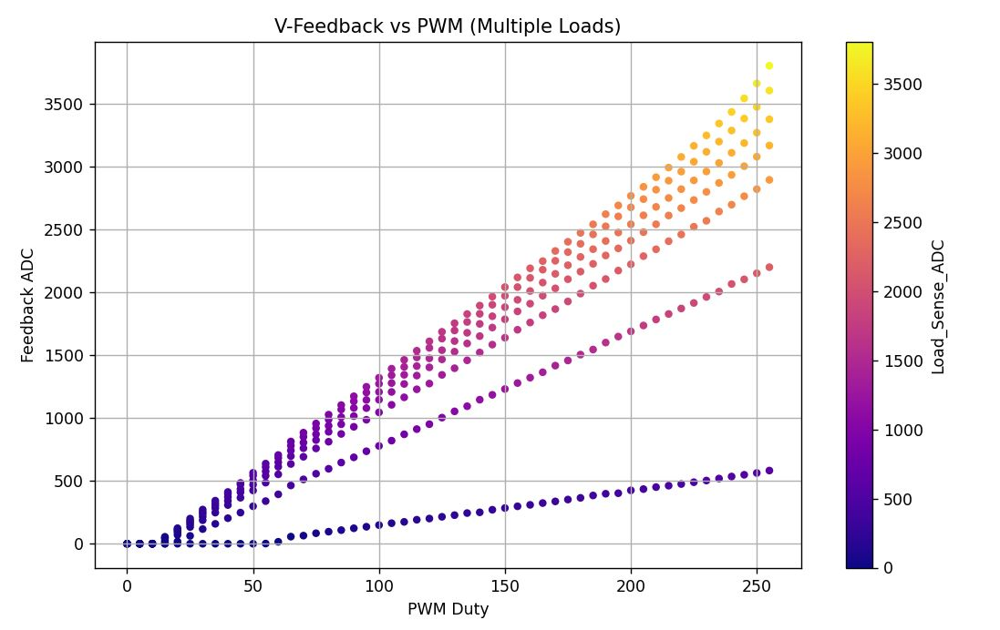
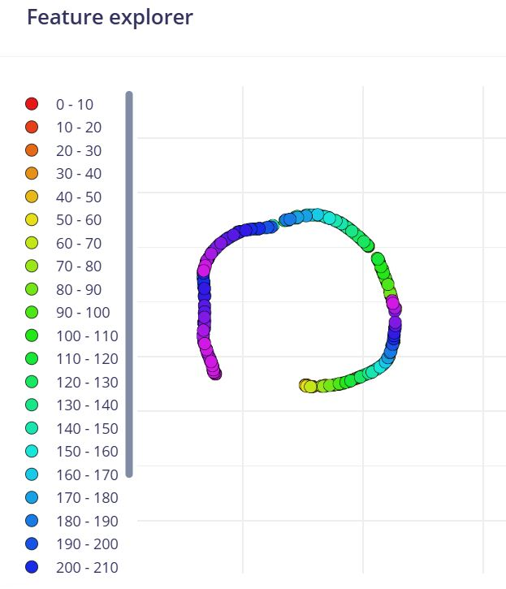
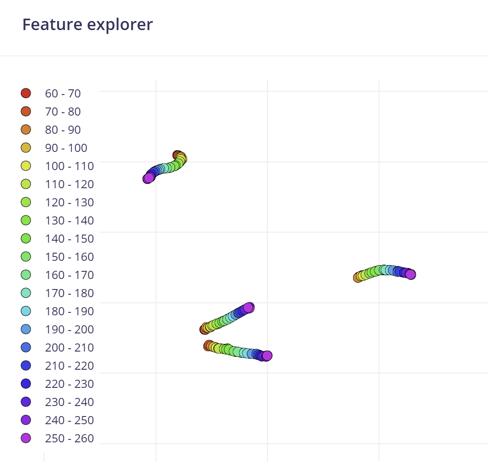
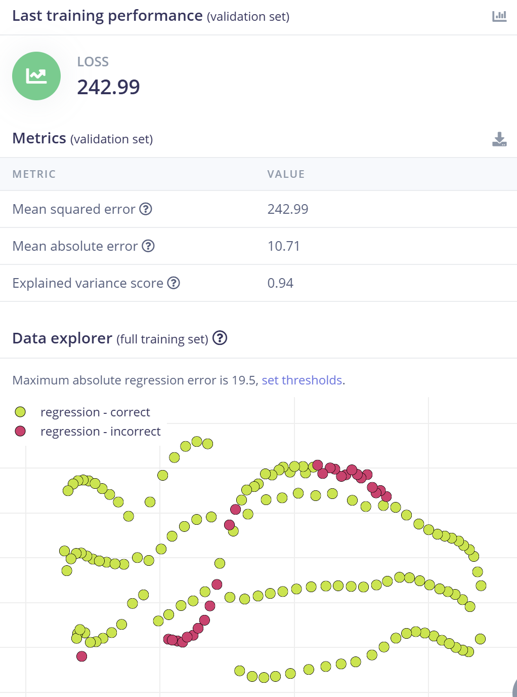
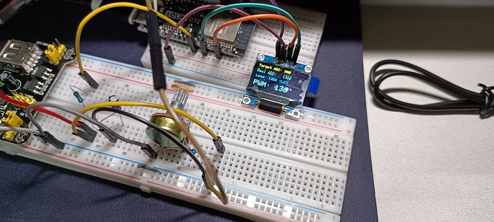

# Smart-Load Adaptive Regulator — An Edge-Impulse-Based Load Adaptive Calibration System

## Problem Statement
When developing precision analog outputs—such as using an ESP32's PWM with an RC filter to generate specific voltages—component tolerance in resistors and capacitors ($\pm 5\%$ to $\pm 10\%$) and ambient temperature can prevent the programmed PWM duty cycle from accurately corresponding to the target voltage. When the circuit is connected to different loads (e.g., devices with varying resistance), the Voltage Divider Effect causes a significant voltage drop. Traditional methods require engineers to manually measure and build complex compensation tables through trial and error, which is extremely inefficient when dealing with variable loads or mass production.

## Why Lookup Tables Fail After Adding a Load?
* 1D Lookup Table: Only records the relationship between PWM and voltage. Once a load is connected and causes a voltage drop, the 1D table immediately becomes obsolete.
* 2D Lookup Table: Must record "(PWM, Load Resistance) $\to$ Output Voltage." This causes the data volume to grow exponentially (squared), consuming excessive memory.
* ML Regression Model: The model can learn the patterns within physical formulas (such as Ohm's Law). It can predict the precise PWM compensation value based on two variables: "Target Voltage" and "Current Load Status," all while maintaining a constant model size.

---

## Wiring

| Component | ESP32 Pin (GPIO) | Functional Description |
| :--- | :--- | :--- |
| **PWM Output** | **GPIO 18** | Outputs a high-frequency PWM signal to the RC filter. The resistor ($1\text{k}\Omega$) is "in series" with the signal path, and the capacitor ($10\mu\text{F}$) is "in parallel" from the output to ground. |
| **Voltage Feedback** | **GPIO 34 (ADC1_6)** | Connected to the node after the RC filter to monitor the actual output voltage (Training Label). |
| **Load Sense** | **GPIO 32 (ADC1_4)** | The middle pin of the potentiometer should be connected "in parallel" with the RC circuit output to simulate and sense load variations (Input Feature). It is recommended to add a small resistor (e.g., $220\Omega$) in series to prevent a complete short circuit. |
| **OLED (SDA)** | **GPIO 21** | Displays target voltage, measured voltage, and ML-predicted PWM. |
| **OLED (SCL)** | **GPIO 22** | Same as above. |

---

## Required Materials
* **Core Controller**: ESP32 Development Board
* **RC Filter Components**: $1\text{k}\Omega$ Resistor, $10\mu\text{F}$ Electrolytic Capacitor
* **Sensing & Simulation Components**: $10\text{k}\Omega$ Potentiometer
* **Display Component**: OLED (SSD1306)
* **Software Platform**: Edge Impulse Studio (Regression Block)
---

## Implementation Steps

### Step 00: Circuit Validation
* Before gathering data, it is recommended to use sample code to validate the circuit and verify how rotating the potentiometer affects the output voltage.
* **Boundary Test**: Set a high target voltage and switch to a heavy load condition. Observe whether the model can drive the PWM to its maximum compensation ($255$) and record the resulting error. This test demonstrates the system's effective operational range.
```cpp
/*
 * Smart-Load Adaptive Regulator: Hardware Verification
 */

#include <Arduino.h>

const int PWM_PIN = 18;
const int FEEDBACK_PIN = 34;
const int LOAD_SENSE_PIN = 32;

const int freq = 5000;
const int resolution = 8; 

void setup() {
  Serial.begin(115200);
  
  if (ledcAttach(PWM_PIN, freq, resolution)) {
    Serial.println("PWM Initialized Successfully");
  }

  ledcWrite(PWM_PIN, 128); 
  
  Serial.println("--- Hardware Verification Mode (v3.0+) ---");
  Serial.println("PWM set to 128 (50% duty cycle)");
  Serial.println("Format: [Feedback_ADC] | [Load_Sense_ADC]");
  delay(2000);
}

void loop() {
  int vFeedback = analogRead(FEEDBACK_PIN);
  int loadSense = analogRead(LOAD_SENSE_PIN);

  Serial.print("V-Feedback: ");
  Serial.print(vFeedback);
  Serial.print("\t | Load-Sense: ");
  Serial.println(loadSense);

  delay(200);
}
```

### Step 01: Build a Dynamic Data Collection System
* Configure the Potentiometer: Set up the potentiometer to serve as the variable load.
* Automated Data Acquisition: Program the ESP32 to execute an automated cycle, utilizing the [_python_data_capture_script_](Data_Capture.py) to capture and visualize the data in real-time.

```cpp
/*
 * Project: Smart-Load Adaptive Regulator
 * Description: Sweep PWM from 0 to 255 in steps of 5 vs. Voltage under Variable Loads
 */

#include <Arduino.h>

// Pin Definitions
const int PWM_PIN = 18;          // Output to RC Filter
const int FEEDBACK_PIN = 34;     // ADC1_6: Measures actual V_out
const int LOAD_SENSE_PIN = 32;   // ADC1_4: Measures load characteristics

// PWM Configurations
const int PWM_FREQ = 5000;       // 5kHz
const int PWM_RESOLUTION = 8;    // 8-bit (0-255)

void setup() {
  Serial.begin(115200);

  if (ledcAttach(PWM_PIN, PWM_FREQ, PWM_RESOLUTION)) {
    Serial.println("# System: PWM Initialized Successfully");
  }

  Serial.println("PWM_Duty,Feedback_ADC,Load_Sense_ADC");
  
  delay(3000);
}

void loop() {
  Serial.println("# Status: Starting New Sweep...");

  // Sweep PWM from 0 to 255 in steps of 5
  for (int pwmVal = 0; pwmVal <= 255; pwmVal += 5) {
    ledcWrite(PWM_PIN, pwmVal);
    
    // Allow RC circuit to stabilize (1k Ohm + 10uF)
    delay(150); 

    // Oversampling to reduce ADC noise
    long feedbackSum = 0;
    long loadSum = 0;
    const int SAMPLES = 15;
    
    for (int i = 0; i < SAMPLES; i++) {
      feedbackSum += analogRead(FEEDBACK_PIN);
      loadSum += analogRead(LOAD_SENSE_PIN);
      delay(2);
    }
    
    // Calculate Averages
    float avgFeedback = (float)feedbackSum / SAMPLES;
    float avgLoad = (float)loadSum / SAMPLES;

    Serial.print(pwmVal);
    Serial.print(",");
    Serial.print(avgFeedback, 2);
    Serial.print(",");
    Serial.println(avgLoad, 2);
  }

  // Sweep complete
  ledcWrite(PWM_PIN, 0); 
  Serial.println("# Status: Sweep Finished. Adjust Potentiometer and wait 5 seconds.");
  
  delay(5000); 
}
```

Result from python script capturing data  


### Step 02: Edge Impulse Model Training
* **Input Features**: 1. Target Voltage (Feedback ADC), 2. Load Sense value (ADC).
* **Target Output (Label)**: The required PWM output value (0-255).
* **Learning Block**: Select **Regression** or **Random Forest**.
* **Data Cleaning**: Raw data initially shows poor variance scores and high MSE values, which is due to **hardware dead zones** (ESP32 ADC threshold limitations and RC filter charge characteristics). At low PWM values (e.g., 0-55), the sensors fail to pick up meaningful voltage, resulting in inputs of `[0.0, 0.0]`. This creates a fatal **"One-to-Many" logical contradiction** for the AI — it cannot map the exact same `[0.0, 0.0]` input to multiple different PWM labels (e.g., PWM 5, 10, 40). 
**Solution**: Trim the dataset to remove these dead zones (e.g., start training data from PWM = 60). This "Garbage In, Garbage Out" prevention ensures the model only learns from valid, continuous physical relationships.

| Before data cleaning | after data cleaning |
| -----| ----- |
|  |  |

**Regression Result (After Data Cleaning & Optimization):**
By utilizing the cleaned dataset and optimizing the neural network architecture (e.g., increasing training cycles to 500 and using a deeper `[32, 16]` dense layer setup), the model achieves highly reliable performance:
* **Explained Variance Score**: **> 0.90** (e.g., 0.94), proving the AI has successfully learned the non-linear physical laws (Ohm's Law and Voltage Divider effects) of the circuit.
* **Mean Squared Error (MSE)**: Dropped significantly (e.g., < 300), meaning extreme prediction outliers at the boundaries are minimized.
* **Mean Absolute Error (MAE)**: **~10**, meaning the predicted PWM deviates by only ~4% from the ideal value across the 0-255 range, which is highly accurate for hardware compensation.
* **Quantized (int8) Efficiency**: The model can be successfully quantized to 8-bit, ensuring it consumes minimal RAM/Flash on the ESP32 while maintaining rapid inference speeds for real-time control.  


### Step 03: Comparison and Verification
* Experiment : Use the ML regression model.
* **Testing**: Rotate the potentiometer freely to change the load and observe which method maintains the target output voltage despite the voltage drop.
* Expected Outcomes
    * **Load Compensation**: When the load changes, the ML model will automatically increase the PWM to compensate for the voltage drop, maintaining a stable output.    
    * **Hardware-Software Co-design**: Achieves automated software calibration that overcomes physical component tolerances and hardware inaccuracies.
    


---
