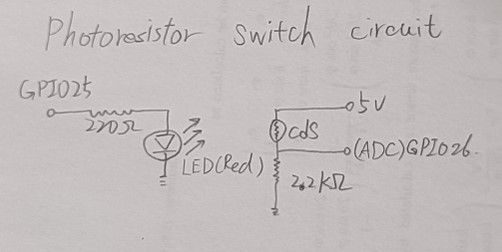
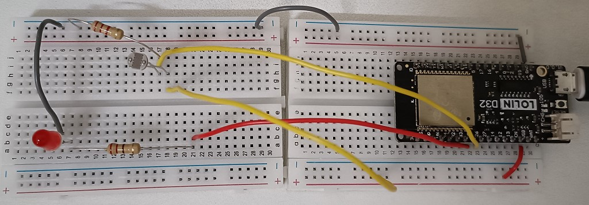
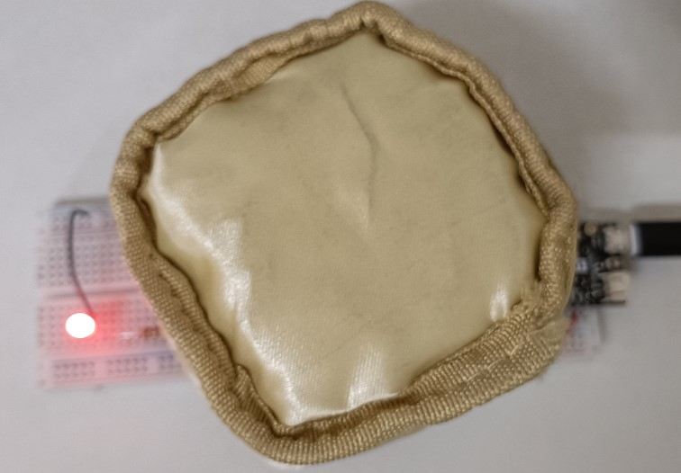

# Photoresistor Switch Circuit

read the resistance changing of the photoresistor and convert it into a logic high or logic low, which turns LED on or off.



# Components
* ESP32 WeMos LOLIN D32
* USB
* Breadboard
* wires
* 1 unit of LED
* 1 unit of 220Ω
* 1 unit of 2.2kΩ
* 1 unit of CdS photoresistor

# Software
* IDE: Arduino IDE

# Wiring
||

Left img shows the wiring, and right img shows after decreasing luminosity on photoresistor surface, then turn on LED

# Code
* GPIO25 to control LED on or off
* GPIO26 with analogRead function to read photoresistor voltage value
* alter luminosity on photoresistor surface

```C++
int GPIO_pin = 25; //voltage output
int ADC_pin = 26; //read the voltage changing from photoresistor

void setup() {
  // put your setup code here, to run once:
  Serial.begin(115200);
  pinMode(GPIO_pin, OUTPUT);
  digitalWrite(GPIO_pin, LOW);
  delay(1500);
}

void loop() {
  // put your main code here, to run repeatedly:
  int adc_value=analogRead(ADC_pin);
  Serial.println(adc_value);
  //if photoresistor voltage reading is less then 1000, then turn on LED
  if(adc_value<1000)
    digitalWrite(GPIO_pin, HIGH);
  else
    digitalWrite(GPIO_pin, LOW);
}
```
