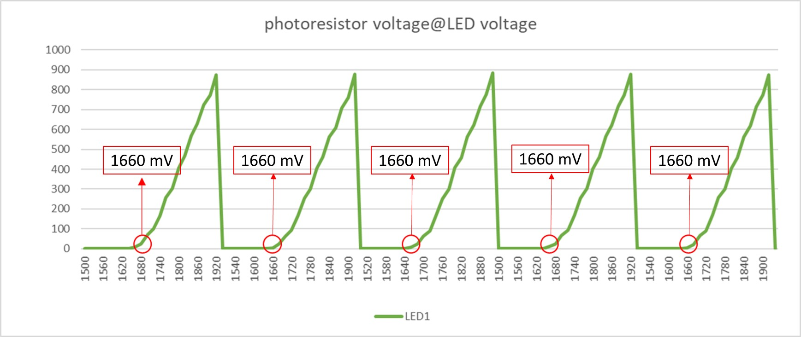
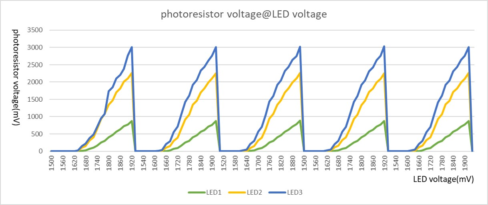

# Calculation
from the LED1 data below, we find there is a turning point as LED voltage is 1660mV.

by using a formula, E=hv=eV , it's able to calculate the h, the Planck constant.
where E is energy, v=c/λ (v is light frequenct; c is light speed; λ is wavelength), e is electron charge, V is voltage.

since it's red LED, we assume wavelength is 700nm [(red_LED_datasheet)](RED_LED_datasheet/BL-B5134-AT.pdf). And Planck constant is defined as $6.626*10^{-34}$. below is the table manifests all caculated results for 3 units of red LED.

|      | Voltage (mV) | Energy (E=eV) | Frequency (Hz) | Planck Constant (h) | error (%) |
| ---- | ------------- | ------------- | ------------- | ------------------- | --------- |
| LED1 |   1660  | $2.656*10^{-19}$ | $4.285*10^{14}$ | $6.198*10^{-34}$ | 6.4% |
| LED2 |   1640  | $2.624*10^{-19}$ | $4.285*10^{14}$ | $6.123*10^{-34}$ | 7.5% |
| LED3 |   1640  | $2.624*10^{-19}$ | $4.285*10^{14}$ | $6.123*10^{-34}$ | 7.5% |

all errors, $\frac{experimentValue-definedValue}{definedValue}$(%), are less than 10%.

# Comparision of 3 units of LED

From above data, the luminosity of LED1 is less then the others, it may be due to the distance or emitting angle of LED and photoresistor. It will cause the photon received on photoresistor, then affects the result.

# Discussion
* from the calculated results, all errors are less than 10%
* the error may comes from
  - resolution of DAC value, the controlling the LED voltage
  - resolution of ADC value, the reading from voltage on photoresistor
  - sensitivity of photoresistor
  - distance or emitting angle of LED and photoresistor
* improvement
  - pick up different color LED to double-check
  - reduce setup impact factors, as distance or emitting angle of LED and photoresistor
