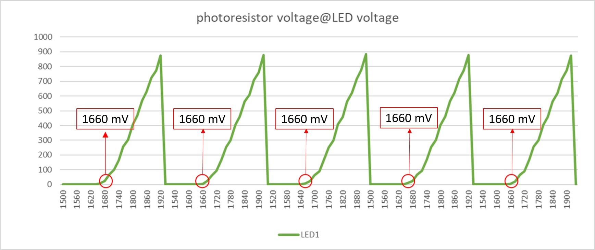

# Planck constant experiment
in this lab, we use threshold voltage of Red LED to determine the Planck constant. [(Reference)](https://ncmn.unl.edu/outreach/Home_Resources/PlanckAnnotations.pdf)


# Components
* ESP32 WeMos LOLIN D32
* USB
* Breadboard
* wires
* 3 unit of red LED
* 1 unit of 220Ω
* 1 unit of 2.2kΩ
* 1 unit of CdS photoresistor

# Software
* IDE: Arduino IDE
* Python module: PySerial [(Reference)](https://www.instructables.com/Capture-Data-From-Arduino-to-CSV-File-Using-PySeri/), and python code is attached [here](MCU_COMtoCSV.py).

# Wiring
after setup the circuit, using a shelter to cover the LED and photoresistor, it is used to avoid other light resource affects the reading voltage value on photoresistor


# Code
* GPIO25 is voltage resource, and dacWrite() is used to sweep voltage from 1.5V to 1.92V with step 0.02V
* Reading digital value on GPIO26 as indicated in circuit diagram, and it's converted into voltage.
* Gather the data by PySerial module, and analyze the data
* after 5-cycles voltage sweeping, it's changed to another Red LED. Total is 3 units of LED results. [(RawData)](RawSensorData.csv)

```C++
int DAC1_pin = 25; //control LED voltage
int ADC_pin = 26; //read the photoresistor voltage

void setup() {
  // put your setup code here, to run once:
  Serial.begin(115200);
  pinMode(DAC1_pin, OUTPUT);
  dacWrite(DAC1_pin, 0);
  delay(1500);
}

int desired_voltage=1500;
void loop() {
  // put your main code here, to run repeatedly:
  int dac_value = map(desired_voltage, 0, 3300, 0, 255);
  //LED voltage(mV)
  dacWrite(DAC1_pin, dac_value);
  delay(4000);

  //read photoresistor voltage(mV)
  int adc_value=analogRead(ADC_pin);
  delay(1000);

  Serial.print(desired_voltage);
  Serial.print(",");
  Serial.println((int)(adc_value*3300)/4095);
  delay(500);
  desired_voltage+=20;

  if(desired_voltage>1920)
    desired_voltage=1500;
    delay(3000);
}
```

# Data Analysis
from the LED1 data below, we find there is a turning point as LED voltage is 1660mV.



by using a formula, E=hv=eV , it's able to calculate the h, the Planck constant.
where E is energy, v=c/λ (v is light frequenct; c is light speed; λ is wavelength), e is electron charge, V is voltage.

since it's red LED, we assume wavelength is 700nm.[(red_LED_datasheet)](LAB5_Planck_constant_experiment/RED_LED_datasheet.pdf)
|               | Voltage (mV)  | Energy (E=eV) | Frequency     | Planck Constant (h) | error (%) |
| ------------- | ------------- | ------------- | ------------- | ------------------- | --------- |
| LED1          |         1660  |  $2.656x10^-19$  | Content Cell  | Content Cell        | --------- |
| LED2          |         1640  | Content Cell  | Content Cell  | Content Cell        | --------- |
| LED3          |         1640  | Content Cell  | Content Cell  | Content Cell        | --------- |
