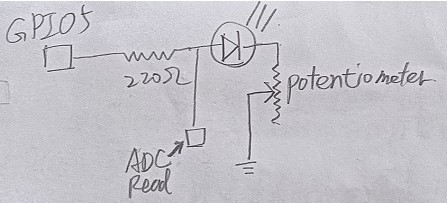
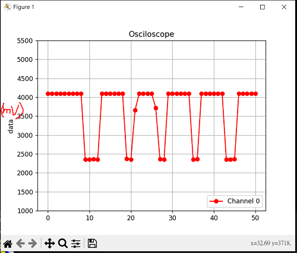
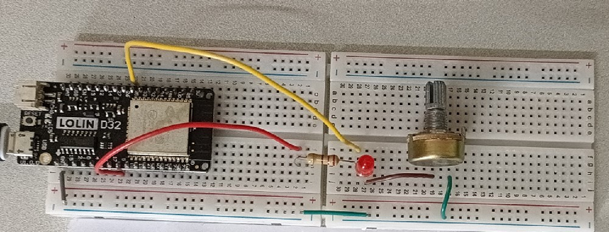

# ESP32 Based Real-Time Oscilloscope

In this practice, we build a simple real time oscilloscope. We take a simple LED circuit with Potentiometer, change voltage and use python to show the waveform. [**Reference material**](https://circuitdigest.com/microcontroller-projects/arduino-oscilloscope-code-circuit)



the waveform plot



# Components
* ESP32 WeMos LOLIN D32
* USB
* Breadboard
* wires
* 1 unit of LED
* 1 unit of 220Ω
* 1 unit of potentiometer

# Software
* IDE: Arduino IDE
* Python module: drawnow, Matplotlib and Pyserial

# Wiring



# Code
* GPIO5 is constant voltage source, and GPIO25 is used for analog read.
* Pyserial module is to communicate over the serial port, drawnow update the plot in real time and Matplotlib generate plots
* python code is [here](LAB6_ESP32_Based_Real_Time_Oscilloscope/RealTimePlot.py)

```C++
int GPIO_pin = 5; //GPIO5 as voltage source
int DAC1_pin = 25; //DAC1 as analog input voltage meter

void setup() {
  // put your setup code here, to run once:
  Serial.begin(115200);
  pinMode(GPIO_pin, OUTPUT);
  digitalWrite(GPIO_pin,HIGH);
  delay(1000);
}

void loop() {
  // put your main code here, to run repeatedly:
  float sensorValue = analogRead(DAC1_pin);
  byte data = Serial.read();
  if (data == 's')
  {
    Serial.println(sensorValue);
    delay(10);        // delay in between reads for stability
  }
}
```
