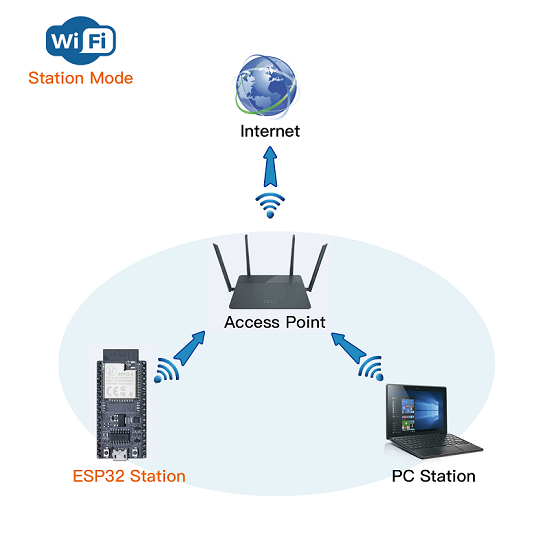

# ESP32 as WIFI Station

in this practice, ESP32 is configured as Wifi station. When the ESP32 is successfully connected to the WiFi router, the serial port monitor will print out the IP address assigned to the ESP32 and display the connection status information: working mode, Channel, SSID, Passphrase, and BSSID.

# Components
* ESP32 WeMos LOLIN D32
* USB

# Software
IDE: Arduino IDE

# Code
* use GPIO5 as a power source
* push switcher to see if RC circuit lights up LED, and LED light will fade as capacitor discharging
