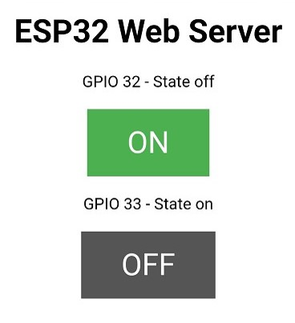

# ESP32 as Web server to control two LEDs

configure ESP32 as a web server and use browser to control two LEDs
reference: [**here**](https://sites.google.com/view/rayarduino/esp32-web-server_two_leds)

# Components
* ESP32 WeMos LOLIN D32
* USB
* Breadboard
* wires
* 2 unit of LED
* 2 unit of 220Ω

|      | both LEDs off | one LED on, and one off | both LEDs on |
| ---- | ------------- | ----------------------- | ------------ |
| Demo |  |  |  |
| Browser |   |  |  |
