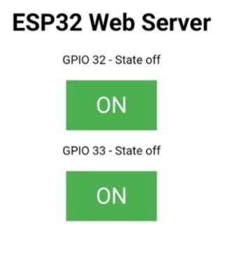

# ESP32 as Web server to control two LEDs

configure ESP32 as a web server and use browser to control two LEDs with GPIO32 and GPIO33

reference: [**here**](https://sites.google.com/view/rayarduino/esp32-web-server_two_leds)

|      | both LEDs off | one LED on, and one off | both LEDs on |
| ---- | ------------- | ----------------------- | ------------ |
| Demo |  |  |  |
| Browser |   |  |  |

# Components
* ESP32 WeMos LOLIN D32
* USB
* Breadboard
* wires
* 2 unit of LED
* 2 unit of 220Ω

# Software
* IDE: Arduino IDE

# Wiring
see the illustrated picture above

# Code
* ssid is the string for network name, and password string is for wifi password
* as connecting wifi server successfully, it will shows the IP address such as 192.168.0.113
* open the browser and turn on/off the LED to check

```C++
#include <WiFi.h>

const char *ssid     = "**********"; //ssid: network name
const char *password = "**********"; //pasword：network password

WiFiServer server(80);  //network server port number is 80

// Variable to store the HTTP request
String header;

String output32State = "off";
String output33State = "off";

// Assign output variables to GPIO pins
const int output32 = 32;
const int output33 = 33;

// Current time
unsigned long currentTime = millis();
// Previous time
unsigned long previousTime = 0; 
// Define timeout time in milliseconds (example: 2000ms = 2s)
const long timeoutTime = 2000;

void setup() {
  // put your setup code here, to run once:
   Serial.begin(115200);        //baud rate is 115200
  // Initialize the output variables as outputs
  pinMode(output32, OUTPUT);
  pinMode(output33, OUTPUT);
  // Set outputs to LOW
  digitalWrite(output32, LOW);
  digitalWrite(output33, LOW);

  Serial.print("Connecting to ");  // connect to Wi-Fi and ESP32 web server IP address
  Serial.println(ssid);
  WiFi.begin(ssid, password);
  while (WiFi.status() != WL_CONNECTED) {
    delay(500);
    Serial.print(".");
  }
  // Print local IP address and start web server
  Serial.println("");
  Serial.println("WiFi connected.");
  Serial.println("IP address: ");
  Serial.println(WiFi.localIP());
  server.begin();
}

void loop() {
  // put your main code here, to run repeatedly:
   WiFiClient client = server.available();   // check esternal client and use browser connect to ESP32 web server

  if (client) {                             // If a new client connects,
    currentTime = millis();
    previousTime = currentTime;
    Serial.println("New Client.");          // print a message out in the serial port
    String currentLine = "";                // make a String to hold incoming data from the client
    while (client.connected() && currentTime - previousTime <= timeoutTime) {  // loop while the client's connected
      currentTime = millis();
      if (client.available()) {             // if there's bytes to read from the client,
        char c = client.read();             // read a byte, then
        Serial.write(c);                    // print it out the serial monitor
        header += c;
        if (c == '\n') {                    // if the byte is a newline character
          // if the current line is blank, you got two newline characters in a row.
          // that's the end of the client HTTP request, so send a response:
          if (currentLine.length() == 0) {
            // HTTP headers always start with a response code (e.g. HTTP/1.1 200 OK)
            // and a content-type so the client knows what's coming, then a blank line:
            client.println("HTTP/1.1 200 OK");
            client.println("Content-type:text/html");
            client.println("Connection: close");
            client.println();
            
            // receive msg from client，and turn on/off the LED
            if (header.indexOf("GET /32/on") >= 0) {
              Serial.println("GPIO 32 on");
              output32State = "on";
              digitalWrite(output32, HIGH);
            } else if (header.indexOf("GET /32/off") >= 0) {
              Serial.println("GPIO 32 off");
              output32State = "off";
              digitalWrite(output32, LOW);
            } else if (header.indexOf("GET /33/on") >= 0) {
              Serial.println("GPIO 33 on");
              output33State = "on";
              digitalWrite(output33, HIGH);
            } else if (header.indexOf("GET /33/off") >= 0) {
              Serial.println("GPIO 33 off");
              output33State = "off";
              digitalWrite(output33, LOW);
            }
            
            // design brower format on client site on html
            client.println("<!DOCTYPE html><html>");
            client.println("<head><meta name=\"viewport\" content=\"width=device-width, initial-scale=1\">");
            client.println("<link rel=\"icon\" href=\"data:,\">");
            // CSS to style the on/off buttons 
            // Feel free to change the background-color and font-size attributes to fit your preferences
            client.println("<style>html { font-family: Helvetica; display: inline-block; margin: 0px auto; text-align: center;}");
            client.println(".button { background-color: #4CAF50; border: none; color: white; padding: 16px 40px;");
            client.println("text-decoration: none; font-size: 30px; margin: 2px; cursor: pointer;}");
            client.println(".button2 {background-color: #555555;}</style></head>");
            
            // Web Page Heading
            client.println("<body><h1>ESP32 Web Server</h1>");
            
            // Display current state, and ON/OFF buttons for GPIO 26  
            client.println("<p>GPIO 32 - State " + output32State + "</p>");
            // If the output26State is off, it displays the ON button       
            if (output32State=="off") {
              client.println("<p><a href=\"/32/on\"><button class=\"button\">ON</button></a></p>");
            } else {
              client.println("<p><a href=\"/32/off\"><button class=\"button button2\">OFF</button></a></p>");
            } 
               
            // Display current state, and ON/OFF buttons for GPIO 27  
            client.println("<p>GPIO 33 - State " + output33State + "</p>");
            // If the output27State is off, it displays the ON button       
            if (output33State=="off") {
              client.println("<p><a href=\"/33/on\"><button class=\"button\">ON</button></a></p>");
            } else {
              client.println("<p><a href=\"/33/off\"><button class=\"button button2\">OFF</button></a></p>");
            }
            client.println("</body></html>");
            
            // The HTTP response ends with another blank line
            client.println();
            // Break out of the while loop
            break;
          } else { // if you got a newline, then clear currentLine
            currentLine = "";
          }
        } else if (c != '\r') {  // if you got anything else but a carriage return character,
          currentLine += c;      // add it to the end of the currentLine
        }
      }
      }
    // Clear the header variable
    header = "";
    // Close the connection
    client.stop();
    Serial.println("Client disconnected.");
    Serial.println("");
  }
}
```
