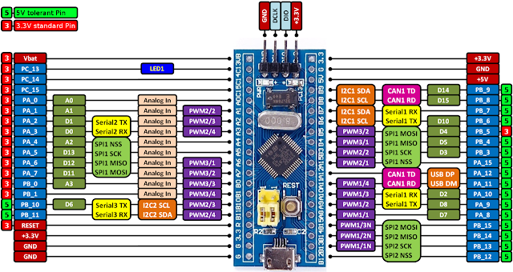

# About
This repository showcases a series of hands-on electronics experiments and microcontroller-based projects, primarily built around the MCU platform. Each lab explores a unique concept—from analog signal processing and sensor integration to web-controlled interfaces and transistor diagnostics. Designed for clarity, modularity, and reuse, these projects serve as both a personal learning archive and a collaborative resource for makers, educators, and engineers.

Explore the labs below, sorted by progression and topic.

# Project Index (Sorted by LAB Number)
## 🔧 Project Index (Sorted by LAB Number)
- [LAB1_RC_circuit/](LAB1_RC_circuit/)
- [LAB2_Analog_Input_Voltage/](LAB2_Analog_Input_Voltage/)
- [LAB3_binary_display_with_LED/](LAB3_binary_display_with_LED/)
- [LAB4_Photoresistor_switch_circuit/](LAB4_Photoresistor_switch_circuit/)
- [LAB5_Planck_constant_experiment/](LAB5_Planck_constant_experiment/)
- [LAB6_ESP32_Based_Real_Time_Oscilloscope/](LAB6_ESP32_Based_Real_Time_Oscilloscope/)
- [LAB7_ESP32_as_WIFI_Station/](LAB7_ESP32_as_WIFI_Station/)
- [LAB8_R-2R_resistive_ladder/](LAB8_R-2R_resistive_ladder/)
- [LAB9_ESP32_WebServer_control_Two_LEDs/](LAB9_ESP32_WebServer_control_Two_LEDs/)
- [LAB10_ESP32_WebServer_slider_control_LED_PWM/](LAB10_ESP32_WebServer_slider_control_LED_PWM/)
- [LAB11_Read_temperature_with_OLED_display/](LAB11_Read_temperature_with_OLED_display/)
- [LAB12_practice_on_APDS9960_sensor/](LAB12_practice_on_APDS9960_sensor/)
- [LAB13_555Timer_Function_Table_Test/](LAB13_555Timer_Function_Table_Test/)
- [LAB14_Verify_P2N2222A_Amplifier-Transistor_Switching/](LAB14_Verify_P2N2222A_Amplifier-Transistor_Switching/)
- [LAB15_P2N2222A-Amplifier-Transistor_voltage_validation/](LAB15_P2N2222A-Amplifier-Transistor_voltage_validation/)
- [LAB16_NE555P_Astable_Test_validation/](LAB16_NE555P_Astable_Test_validation/)
- [LAB17_APDS-9960_Proximity_Test/](LAB17_APDS-9960_Proximity_Test/)
- [LAB18_Weight_Sensor_HX711_module_Load_Cell_Calibration/](LAB18_Weight_Sensor_HX711_module_Load_Cell_Calibration/)
- [LAB19_Color_Sensor_and_OLED_Display_Integration_Test/](LAB19_Color_Sensor_and_OLED_Display_Integration_Test/)
- [LAB20_Sensor_Fusion_by_using_HX711_and_APDS-9960_Modules/](LAB20_Sensor_Fusion_by_using_HX711_and_APDS-9960_Modules/)
- [LAB21_Smart_Sorting_System_with_HX711_and_APDS-9960_Modules/](LAB21_Smart_Sorting_System_with_HX711_and_APDS-9960_Modules/)
- [LAB22_Simple_Magnetic_Control_Light_using_a_Reed_Switch/](LAB22_Simple_Magnetic_Control_Light_using_a_Reed_Switch/)
- [LAB23_STM32-ESP32_Dual_MCU_Communication_Setup/](LAB23_STM32-ESP32_Dual_MCU_Communication_Setup/)
- [LAB24_STM32F103_DMA_Data_Acquisition_and_Analysis/](LAB24_STM32F103_DMA_Data_Acquisition_and_Analysis/)
- [LAB25_STM32F103_DMA-Based_Analog_Signal_Acquisition_and_UART_Output_Practice/](LAB25_STM32F103_DMA-Based_Analog_Signal_Acquisition_and_UART_Output_Practice/)
- [LAB26_Electronics_Circuit_System_Thinking_Experiment_with_NE555_RC_Oscillator/](LAB26_Electronics_Circuit_System_Thinking_Experiment_with_NE555_RC_Oscillator/)
- [LAB27_Angle-Pressure_Chain_Reaction_for_Monitoring_Tilting_Structure/](LAB27_Angle-Pressure_Chain_Reaction_for_Monitoring_Tilting_Structure/)
- [LAB28_Quantum-Scale_Stochastic_Resonance-QSR_Simulator/](LAB28_Quantum-Scale_Stochastic_Resonance-QSR_Simulator/)
- [LAB29_Analog_Quantum_Dispersive_Readout_Simulator/](LAB29_Analog_Quantum_Dispersive_Readout_Simulator/)
- [LAB30_Blochsphere-on-Hand_A_Sensor-Based_Interactive_Holographic_Projection/](LAB30_Blochsphere-on-Hand_A_Sensor-Based_Interactive_Holographic_Projection/)

# Microcontroller, ESP32

# specs
* Processors:
  * CPU: Xtensa dual-core (or single-core) 32-bit LX6 microprocessor, operating at 160 or 240 MHz and performing at up to 600 DMIPS
  * Ultra low power (ULP) co-processor
* Memory: 520 KiB SRAM
* Wireless connectivity:
  * Wi-Fi: 802.11 b/g/n
  * Bluetooth: v4.2 BR/EDR and BLE (shares the radio with Wi-Fi)
* Peripheral interfaces:
  * 12-bit SAR ADC up to 18 channels
  * 2 × 8-bit DACs
  * 10 × touch sensors (capacitive sensing GPIOs)
  * 4 × SPI
  * 2 × I²S interfaces
  * 2 × I²C interfaces
  * 3 × UART
  * SD/SDIO/CE-ATA/MMC/eMMC host controller
  * SDIO/SPI slave controller
  * Ethernet MAC interface with dedicated DMA and IEEE 1588 Precision Time Protocol support
  * CAN bus 2.0
  * Infrared remote controller (TX/RX, up to 8 channels)
  * Motor PWM
  * LED PWM (up to 16 channels)
  * Hall effect sensor
  * Ultra low power analog pre-amplifier
* Security:
  * IEEE 802.11 standard security features all supported, including WFA, WPA/WPA2 and WAPI
  * Secure boot
  * Flash encryption
  * 1024-bit OTP, up to 768-bit for customers
  * Cryptographic hardware acceleration: AES, SHA-2, RSA, elliptic curve cryptography (ECC), random number generator (RNG)
* Power management:
  * Internal low-dropout regulator
  * Individual power domain for RTC
  * 5μA deep sleep current
  * Wake up from GPIO interrupt, timer, ADC measurements, capacitive touch sensor interrupt
* Battery management
  * Connector for 3.7v battery (like 18650).

# Microcontroller, STM32F103C8

# specs
* ARM®32-bit Cortex®-M3 CPU Core
  * 72 MHz maximum frequency,1.25 DMIPS/MHz (Dhrystone 2.1) performance at 0 wait state memory access
  * Single-cycle multiplication and hardware division
* Memories
  * 64 or 128 Kbytes of Flash memory
  * 20 Kbytes of SRAM
* Clock, reset and supply management
  * 2.0 to 3.6 V application supply and I/Os
  * POR, PDR, and programmable voltage detector (PVD)
  * 4-to-16 MHz crystal oscillator
  * Internal 8 MHz factory-trimmed RC
  * Internal 40 kHz RC
  * PLL for CPU clock
  * 32 kHz oscillator for RTC with calibration
* Low-power
  * Sleep, Stop and Standby modes
  * VBAT supply for RTC and backup registers
* 2 x 12-bit, 1 μs A/D converters (up to 16 channels)
  * Conversion range: 0 to 3.6 V
  * Dual-sample and hold capability
  * Temperature sensor
* DMA
  * 7-channel DMA controller
  * Peripherals supported: timers, ADC, SPIs, I2Cs and USARTs
* Up to 80 fast I/O ports
  * 26/37/51/80 I/Os, all mappable on 16 external interrupt vectors and almost all 5 V-tolerant
* Debug mode
  * Serial wire debug (SWD) & JTAG interfaces
* 7 timers
  * Three 16-bit timers, each with up to 4 IC/OC/PWM or pulse counter and quadrature (incremental) encoder input
  * 16-bit, motor control PWM timer with dead-time generation and emergency stop
  * 2 watchdog timers (Independent and Window)
  * SysTick timer 24-bit down-counter
* Up to 9 communication interfaces
* Up to 2 x I2C interfaces (SMBus/PMBus)
* Up to 3 USARTs (ISO 7816 interface, LIN, IrDA capability, modem control)
* Up to 2 SPIs (18 Mbit/s)
* CAN interface (2.0B Active)
* USB 2.0 full-speed interface
* CRC calculation unit, 96-bit unique ID